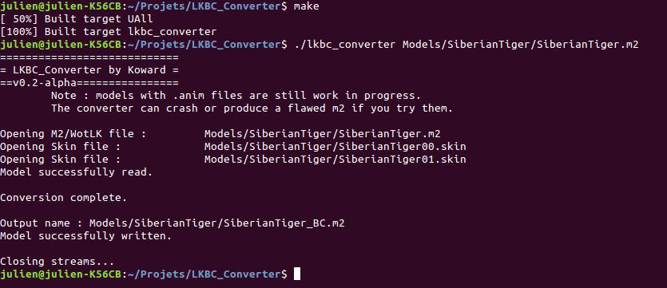

Hi !
I worked hard to implement proper handling of models with .anim files and it's done, at least I hope it is.
I haven't tested character models yet, however. They are very complex so I doubt the converter will work.
This is still a prototype and there are countless bugs. Don't hesitate to report them.

## Changelog
* Added support for .anim files
* Redesigned the AnimLookup&PlayAnimLookup generation
* Countless bugfixes

## Screenshot

## Links
* [Github](https://github.com/Koward/LKBC_Converter)

-- Koward