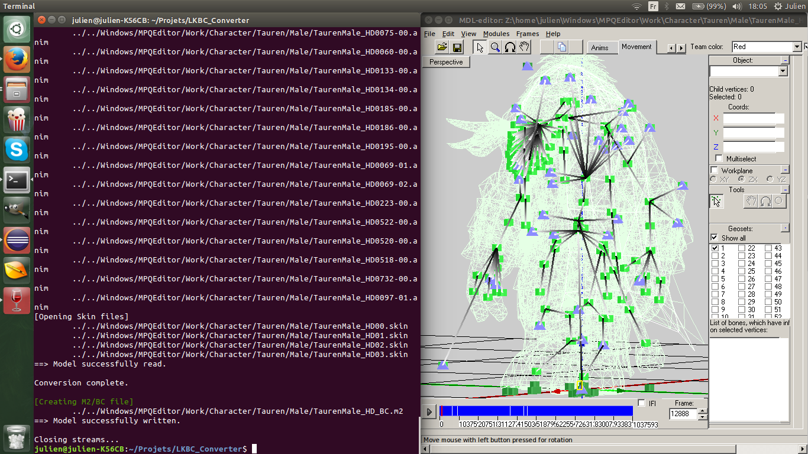

While working with the previous version, I realized there were a lot of major bugs.
Fixing them required discussions on Modcraft and a lot of work.
There were also Windows-only bugs which I hope are now fixed.

## Changelog
* Countless bugfixes
* Increased speed
* Safety checks for Animation Lookup (most game-crashing models fixed)
* Colored text for modern terminal programs (I was bored) All creatures I tested seem to work. If you want to preview your model, just open it with MDLVis : the M2/BC format can be directly opened with this editor. ;)

This update is really more stable, and I really recommend to use it. Throw away the previous ones.

## Screenshot

## Links
* [Github](https://github.com/Koward/LKBC_Converter)

-- Koward