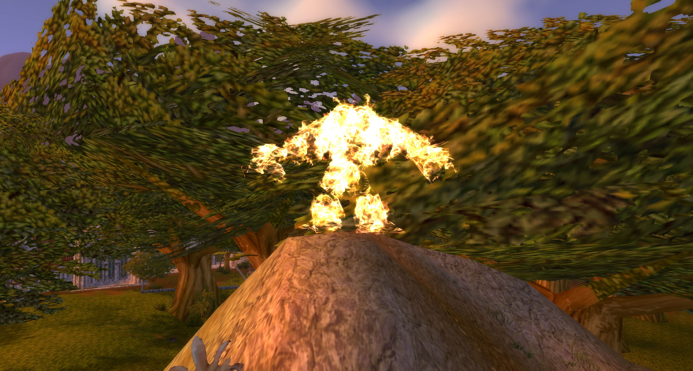

## Basic Texture Animations

This will teach you how to create texture animations, how to setup additional materials and what to do with the renderflags.

1. Get your model
2. Search for a texture which is like what you want the flames (or ice, poison, etc) to look like. Example:

	WORLD\EXPANSION02\DOODADS\HOWLINGFJORD\FIREFX\T_VFX_FIRE_ANIM02_128_FULL_DESAT.BLP

3. Open your model in PyModelEditor 
4. Change the textures of the body of your model to your texture. Note: X- and Y-Wrap give sometimes a better effect. 

5. Add a GlobalSequence for your TextureAnimation 

6. Add an UV(==TextureMapping)-Animation 

7. There create a Translation-Block like 

and a Scaling-Block like 

8. Add/Change a Renderflag to Modulate 2x (to remove the black parts of the texture) 

9. Add a new Material for each geoset and give them the animation parameter. 

10. Fine you are done. Grats to your flaming creature. 

