# Custom WMO Survival Kit

## Tools Used
* Blender
* Notepad++
* 010 editor
* 010 editor templates
* MODR Chunk file
* BLPconverter
* MirrorMachine
* MPQ editor
* WMO editor

## Summary
1. Build the model before conversion.
2. Conversion of *.obj to *.wmo.S
3. Add some doodads with WMOeditor.
4. Add a doodadset.
5. Additional information: transparent textures, collisions, lights.

## Build the model before conversion
To begin, you should know what you want to do. Do some research to find references that will help you give more "credibility" to your building. If you work in a particular architectural style, do not hesitate to find your inspiration from photography, if you are not in a specific style look anyway how Blizzard constructed houses, castles, and other buildings, so your model fits well and is coherent with its environment. The style of Blizzard is particular with its distortions and its side a little "used".

I will not teach you how to make 3D models (I'm not a professional) but I will give you some tips to make it a little bit "optimized" for WoW.

Here I am working on new models of houses for Kul Tiras. The island is in a Mediterranean / Tuscany theme, I did some research to see how the houses are built in these regions.

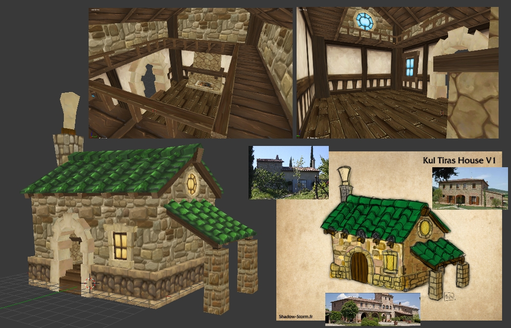

To be sure that your home is at the right scale, you can use (and it is even advisable) the human model *humanmalescale.m2* (because it is the "basic" scale in WoW), but open it large enough for passing a Tauren because it must be accessible to all races (a Tauren can enter in a human house without much problem because of its wide input). The goal is that the player's camera could pass without taking the door jamb in the head.

Don't forget to delete useless faces.

For your model is well composed, it takes several geosets, the number varies depending on the number of "large parts" (as the capitals for example, who have a lot, by districts, house interiors, etc ...). For mine, I based on basic models of human houses, so it will be two geosets: inside and outside.

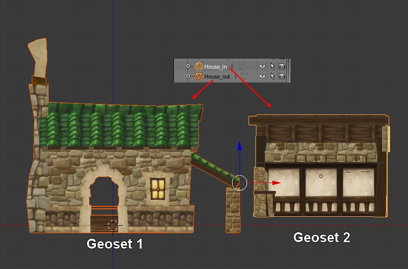

For the instance of Gnomeregan the model has 73 geosets, because it's a big model. Each rooms and tunnels are geosets, sometimes divided into several parts.

This palace (from Phantomx) has 63727 polygons and 58997 faces, it's a really huge model ingame, but it has only 24 geosets.

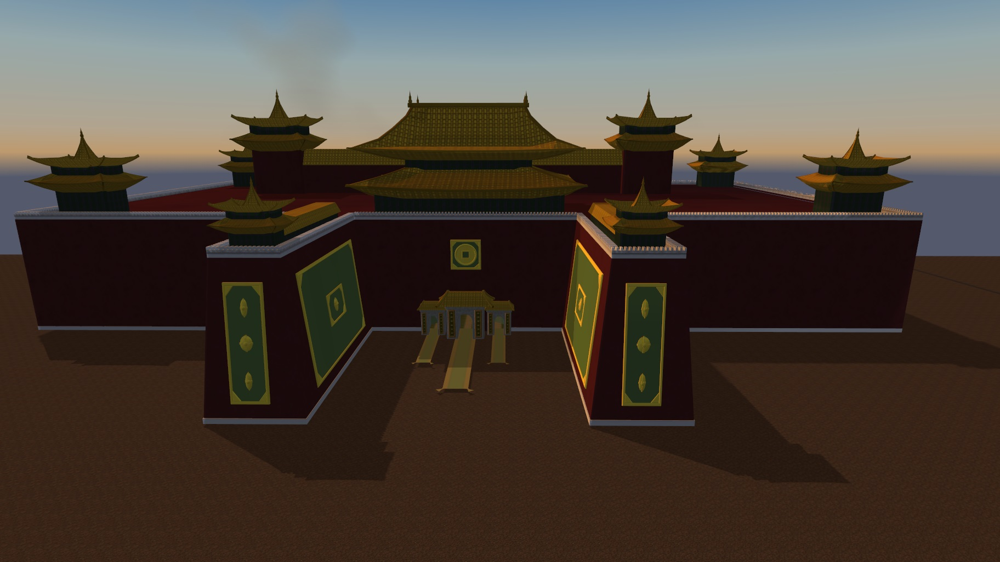

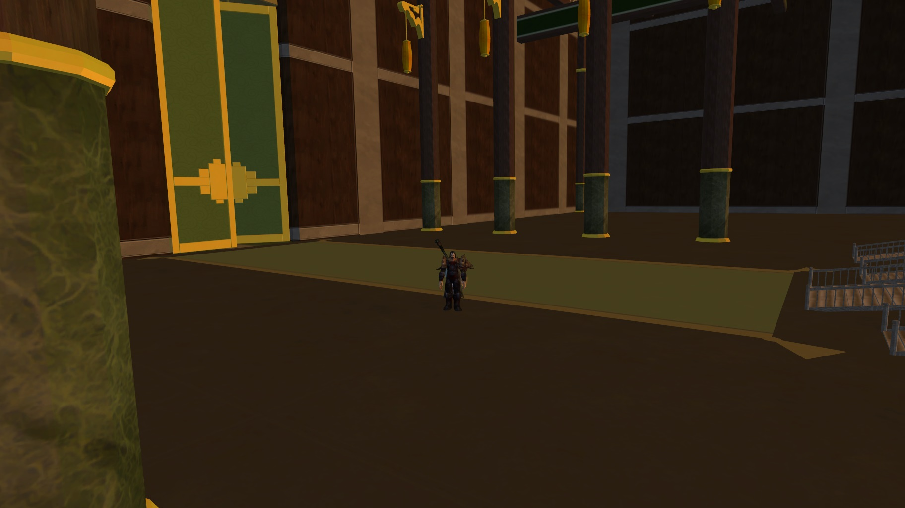

In fact, the number of geosets really depends on how you organize your model, you can't have a wmo with only one geoset if it's a big piece because MirrorMachine can't convert it, you must divide it.

To have a better render with light and shadows, remember to apply the smooth shading on the concerned parts (mainly for use on curved surfaces, straight walls don't necessarily need it).

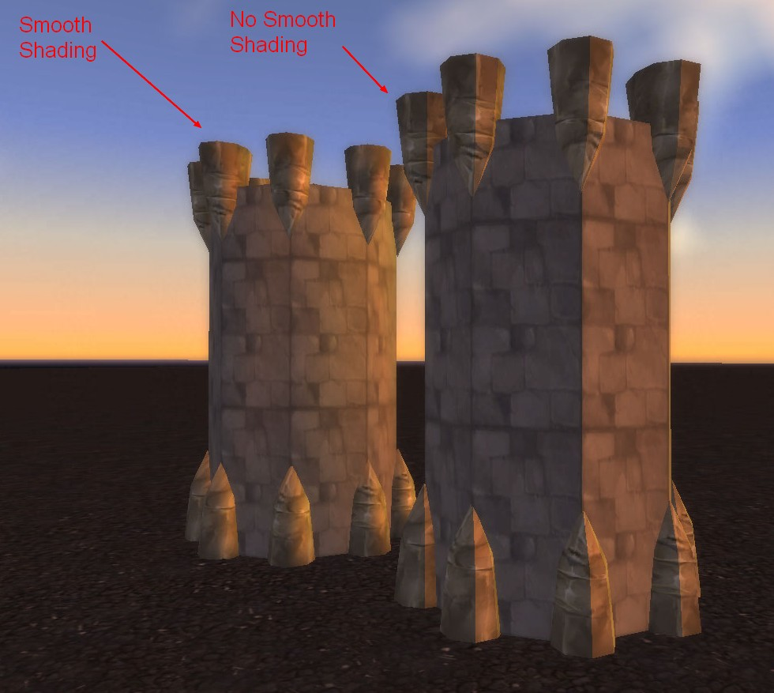

## Conversion of *.obj to *.wmo
We will go to the conversion of the model. First, save it in .obj with the correct options as below.

Once done, you have two files: your model in .obj and a .mtl file with informations about materials and textures. Open the .mtl file with your notepad, you will see the names of materials and patchs of the textures used. Simply change for that of .blp's in the mpq patch. Do it for each texture. (Insert the extension .blp instead of .jpg or .png it's not really important because the converter will add it automatically)

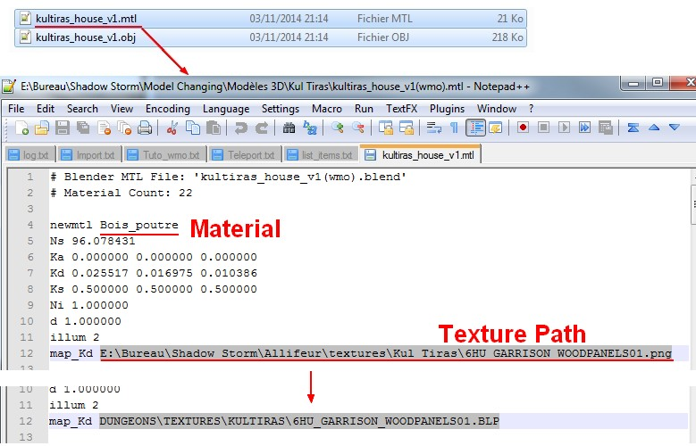

When finished, save and close the .mtl and open MirrorMachine to convert your .obj in .wmo . Select "OBJ File " instead of "WMO v14 ", "Open File " to select and open your model, "Settings " to check that your options are much like on this screenshot. Click "Start Convertion", if your model is well built, it should work without problems.

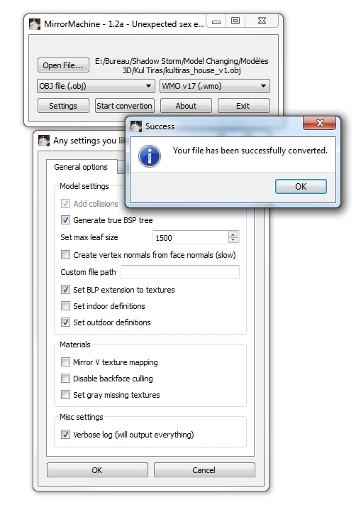

After conversion, you must have your wmo + his group files (the 00 .wmo) corresponding to geosets, so I have two in my case.

To verify that the paths of the textures are good, open your wmo main file in 010 editor with wmo template. Here you can see that's good.

Once everything is checked, you just have to put it in a patch and test it.

Here is the result with a basic human house next for comparison. 

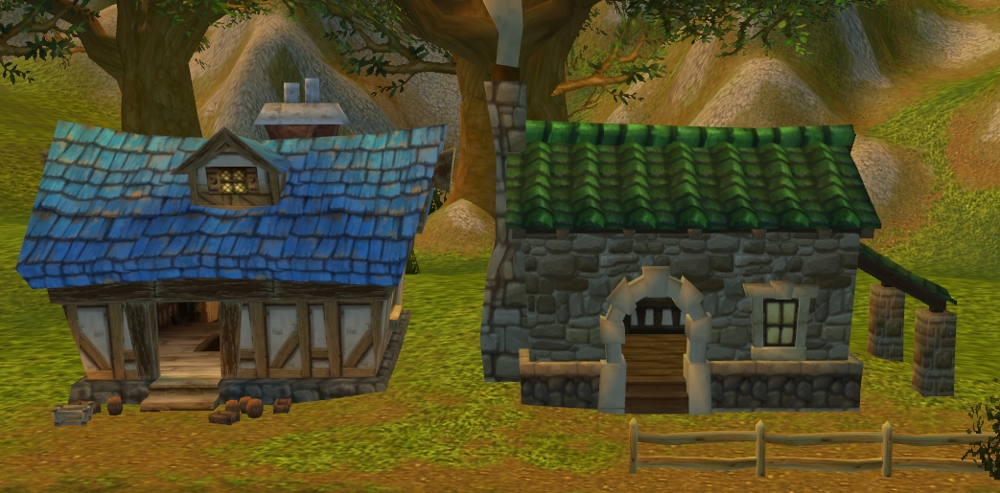

## Add some doodads with WMOeditor
A house that's fine, but without furniture it's a little empty. We are going to fill it with WMOeditor and 010 editor.

This time, open the group file in which you want to add doodads. Do CTRL+F to open the search window. In Type you must have "ASCII String (a)" and write "NBOM" in Value, then click on Find All.

You will have a line including what you want that appears in the lower part of the window. Now do CTRL + I to open an insert window and look for the file containing the chunk for upgrading your sub -parts of wmo.

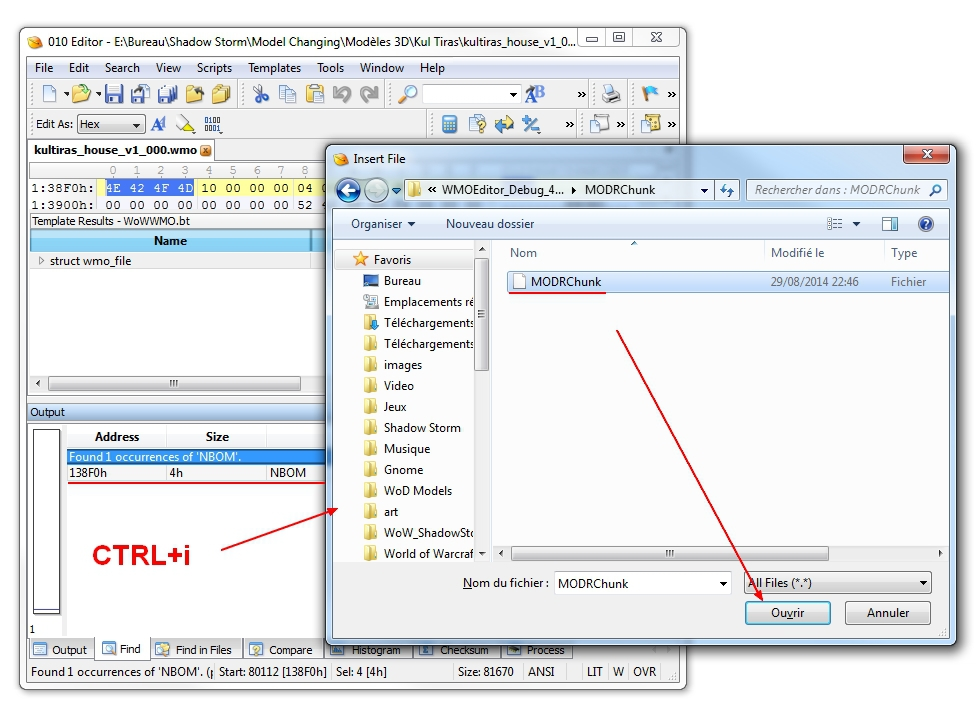

If you compare with your original line and it has changed, then it is good. Save it.

Repeat for each subpart involved in your wmo.

Time to get serious and open WMO editor . At first it can be a little confusing to use because it displays models with a mirror effect.

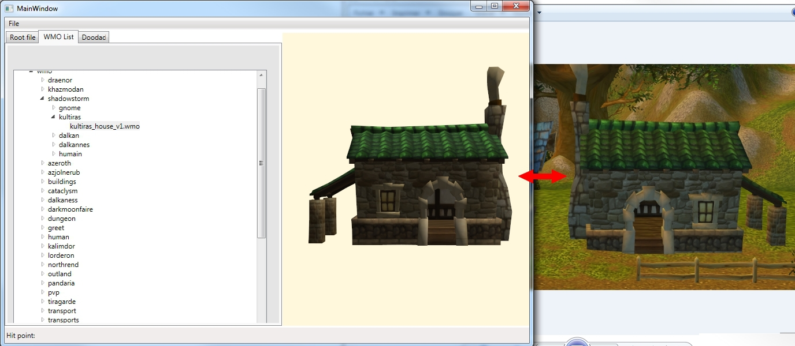

So once your wmo is opened, go to Root File to find the geosets that compose it. Click Edit to see their options, check "Has Doodads". Close the window and repeat on the other remaining.

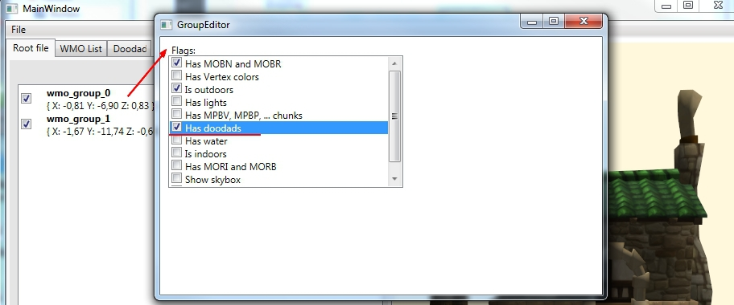

We can finally start placing those famous doodads. Now go to Doodad, in the bottom box is the doodadset that indicates how many m2 it has in total. Most houses have several doodadsets, but I have not figured out how to add a second, I'm working on it.

Click on the [...] to open a window with a list of m2 similar to WoW Model Viewer. Once your selected an object, double-click on it, the window will then leave and you can place it in your wmo. Please note that the window does not close so far, it just comes up behind the first one.

To navigate through the window of your building, the controls are the same as Noggit. Once you have decided where you want to place your object, place your cursor there and made CTRL + V to paste it.

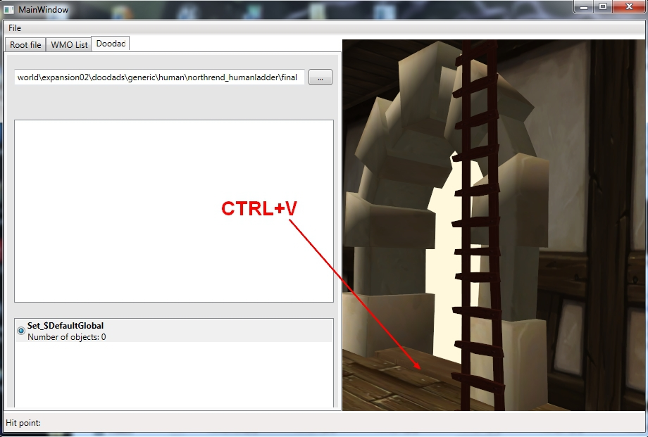

Here are the commands that allow you to move your objects as you like.

Once you're done, save your work in File>Save. Your wmo completed will be saved in the WMO editor folder, in world.

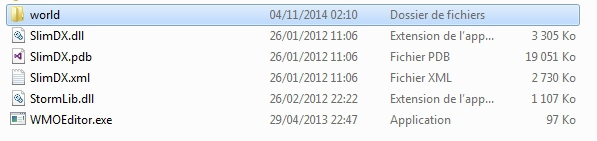

You just have to go in game to see the result.

Congratulations, you are with a furnished house!

## Add a doodadset

> Supora wrote: So this time is about "how to add a doodadset"
When you got your model just after convertion you need to open your root_wmo and all of the group_wmo files in 010 Editor.

Root_wmo edition:

1) In MOHD chunk you need to set the nSets to "1" like this:

2) After edition of nSets you need to insert a MODS chunk. For this you need to find(ctrl+F) NDOM and insert "this". Then you need to find SDOM and change the value after it to 20(hexademical) like this:

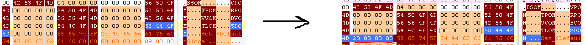

3) Follow the steps which I've already explain to Met@

> Met@ wrote:3]Add some doodads with WMOeditor

A house that's fine, but without furniture it's a little empty.
We are going to fill it with WMOeditor and 010 editor.

This time, open the group file in which you want to add doodads. Do CTRL+F to open the search window. In Type you must have "ASCII String (a)" and write "NBOM" in Value, then click on Find All.

You will have a line including what you want that appears in the lower part of the window. Now do CTRL + I to open an insert window and look for the file containing the chunk for upgrading your sub -parts of wmo.

If you compare with your original line and it has changed, then it is good. Save it.

Repeat for each subpart involved in your wmo.

Time to get serious and open WMO editor . At first it can be a little confusing to use because it displays models with a mirror effect.

So once your wmo is opened, go to Root File to find the geosets that compose it. Click Edit to see their options, check "Has Doodads". Close the window and repeat on the other remaining.

We can finally start placing those famous doodads. Now go to Doodad, in the bottom box is the doodadset that indicates how many m2 it has in total. Most houses have several doodadsets, but I have not figured out how to add a second, I'm working on it.
Click on the [...] to open a window with a list of m2 similar to WoW Model Viewer. Once your selected an object, double-click on it, the window will then leave and you can place it in your wmo. Please note that the window does not close so far, it just comes up behind the first one.

To navigate through the window of your building, the controls are the same as Noggit. Once you have decided where you want to place your object, place your cursor there and made CTRL + V to paste it.

Here are the commands that allow you to move your objects as you like.

Once you're done, save your work in File>Save. Your wmo completed will be saved in the WMO editor folder, in world.

You just have to go in game to see the result.

Congratulations, you are with a furnished house!

4) When you are finished with first doodadset you can add another one. For this you need only to edit the root_wmo file. So agan load it in 010 Editor. Go to MOHD and change the nSets to "2". Then ctrl+F NDOM and insert "this" just like we did earlier. But now it's time for some differences: when we added a new row for MODS chunk we need to change the name of our second doodadset like this:

Then you need to change the index of first doodad used in this set to summ number of doodads used in previous sets(if you already have 2 doodadsets and wanted to add third you set this value to number of doodasds in first set + number of doodads in second. etc etc). In my case I've added only second set when first have only 9 doodads used. So I've change the "first doodad index(FDI)" to "9":

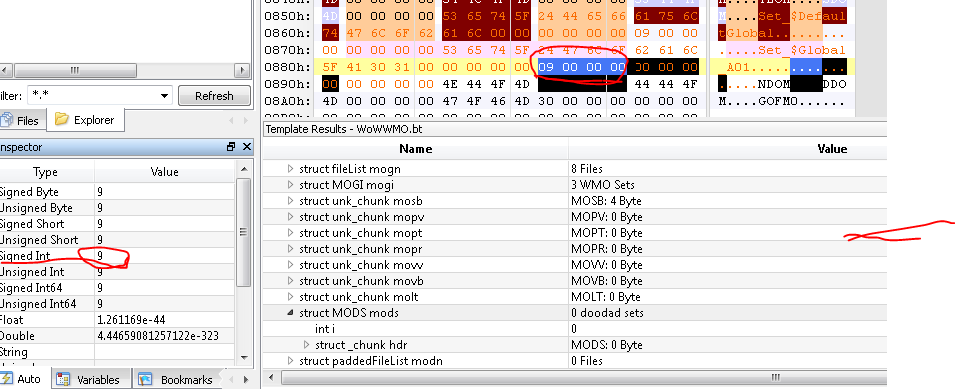

That's it. You can save the file. Pack to mpq and load in WMOEditor.

## Additional Information

### Use textures with transparency
In your buildings, you may be asked to use textures with transparency as a grid for example. On blender, you can see the transparency with the rendered mode or other stuff like that, and the material clearly indicates that there is transparency.

In game you will have opaque texture like all other.

To set the transparency, we have to open the wmo in 010 editor and look in the MOMT chunk. In it, find your texture, at the line " UINT32 blendMode " you will see that the value is 0, it corresponds to the opaque mode, just put 1 in place in order to transparent mode. It's as simple as that. Save everything and voila.

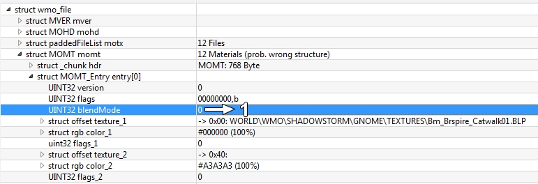

### Collisions
Normally Mirror Machine manages well enough collisions each surface must have. If some places are little bullshit on collisions or you want to make collisions as Blizzard putting invisible walls to avoid falling into a ditch, or just block passages, well I'll tell you how.

Here is an example of collisions that Blizzard has done in Gnomeregan, most of the time there are "boxes" goshawks some pipes or rounded elements such as barrels and also invisible walls to avoid falling in some holes.

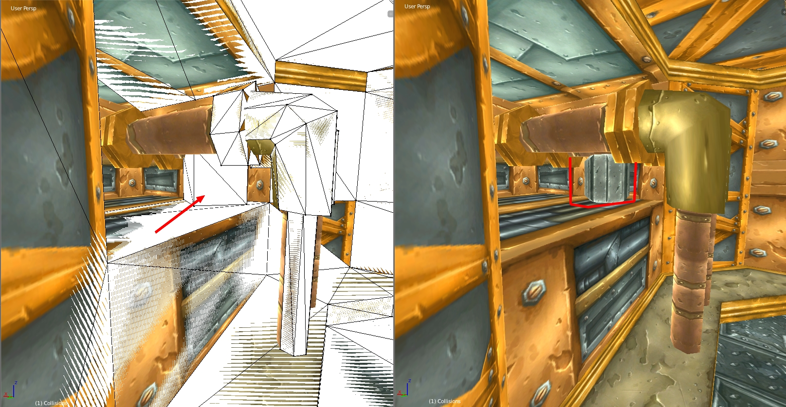

Collisions are in fact a double of the model but with the same number or sometimes fewer polygons and fully transparent. To do the same, you just have to use an invisible texture on your geoset.

> Skarn wrote:If you have collision bugs likr falling under the textures, try to increase the polycount on the buggy place and reconvert the model. If you can't pass trough the door even if the geometry allows that, decrease the collision leaves size in the conveter.

### Adding Lights
Manually with hex editor. You can look at the video made by PhilipTNG, it's pretty well explained.

## Credits
Met@, stan84, Supora, Waveworms