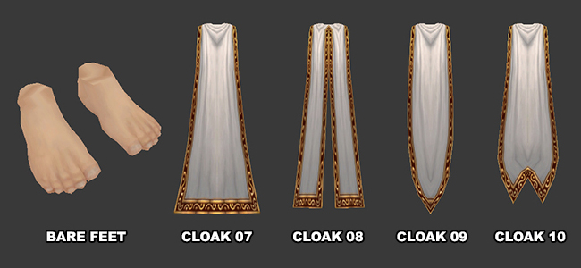
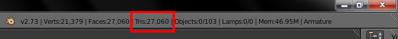
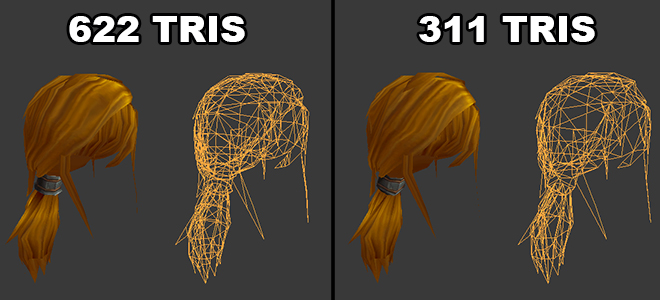
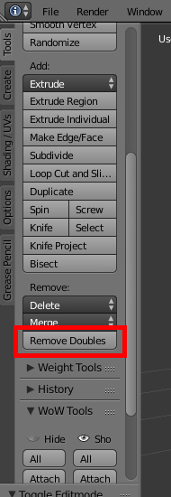
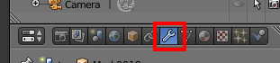
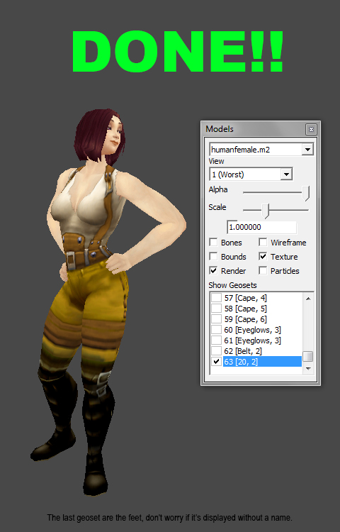

# HD Character Model Triangle Reduction

## Triangle limit explanation
World of Warcraft models have a triangle limit of 21845. In Mists of Pandaria Blizzard managed to bypass this limit by creating geometry levels (see: How Warlords of Draenor skin Works). If you try to retro-port a model that goes over the polygon limit you get something like this:

The extra geometry is rendered as a mess of triangles in modelviewer and you will notice that a lot of geosets are missing in-game. Most people just delete or don't even try to fix them saying that it's impossible to make all geosets work in older versions of the game, but there is a trick to make it happen: reducing the polygon count.

## What's decimate?

Decimate is a Blender modifier that allows you to reduce the polygon count of a mesh with minimal shape changes.

It used to work terribly in older releases but was redesigned in Blender 2.7 and now it's "magical".

We are going decimate some parts of the HD character models to decrease their polygon count and make them fully work in WOTLK (and Cataclysm).

## Tools
- Blender 2.73 (or higer)
- M2MOD Redux 4.6.1

## 1 - Delete version incompatible geosets

There are some geosets that won't show up in older versions and should be deleted to prevent a "polygon overload":

- Bare feet (All draenor HD character models)
- Cloaks from Mesh ID 7 to 10
- Belts with Mesh ID 3 (Pandaren Only)
- Wristband with Mesh ID 4 (Pandaren Only)
- Tabard2 (Pandaren Female Only)

## 2 - Decimating
Once you deleted all unnecessary geometry we are going to start with the polygon reduction process. Don't worry! It's super easy! On the upper right corner of Blender you will find some information about the model. We'll be looking at TRIS. That's the current triangle count.

As you can see my model has 27060 triangles. Previously I said that WoW's limit is 21845, so some of its geosets will broke after conversion. To make it work properly we must get rid of some triangles until we reach 21845 tris or less.

I prefer to only decimate hair geosets. Sometimes you can't tell the difference between the normal and the low poly version because the texture does almost all the work as you can see in the picture:

It almost look the same, doesn't it?

Ok, to the actual process:

- Select the geoset you want to edit and go to Edit Mode. If nothing is selected, select all (shortcut: letter A).
- Go to the panel on the left and click on the "Remove doubles" Button (It's not always necessary, go to the TIPS AND CONCLUSION section for more info).

This option welds all the floating vertices together (we do this to avoid holes in the geometry).

- Now toggle object mode and go to the modifiers tab (on the panel on the right).

- 1° Click on "ADD MODIFIER" and choose DECIMATE.
- 2° Make sure the "Collapse" button is highlighted.
- 3° Click on ratio, write 0.5 and press ENTER.
- 4° Click on APPLY.

DONE! Now this geoset traingle count has decreased by half. Repeat with other hair geosets until your model reaches 21845 tris or less. Then export and convert to M2.

## Tips and Conclusion
Sometimes when I applied the Decimate modifier I found holes in the geometry. That happens because some vertices are not welded. The "remove doubles" option welds all vertices that are close together and rule out the possibility of finding holes on your geometry after decimating BUT is a little risky because you don't have total control over the geometry and it can mess up certain small parts of the uv mapping. If you used it and the final result looks good, awesome. If not just undo your changes, skip it, apply the decimate modifier and weld the vertices by hand.

Personally I recommend you to always avoid the Remove Doubles option and merge the floating vertices by hand to obtain a better result. Handwork takes some time but in this case is the best choice!

However i want to clarify that this process is not 100% automatic, in most cases you will have to deal with holes and misplaced vertices, but it's nothing that can't be repaired in a few minute

## Credits
inico