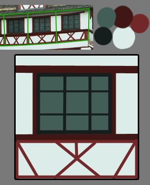
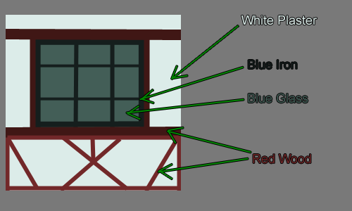
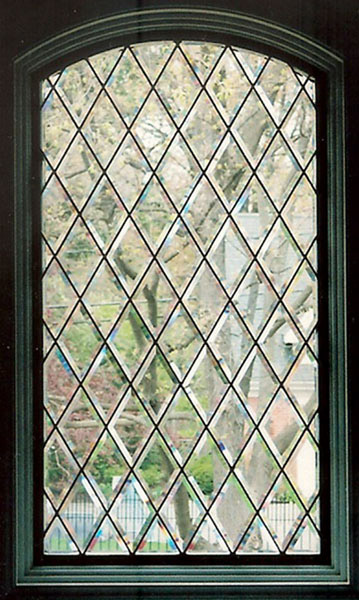
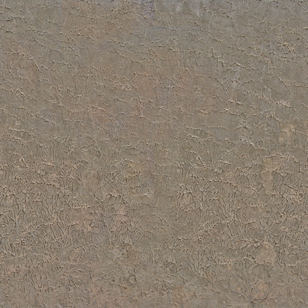
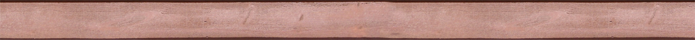
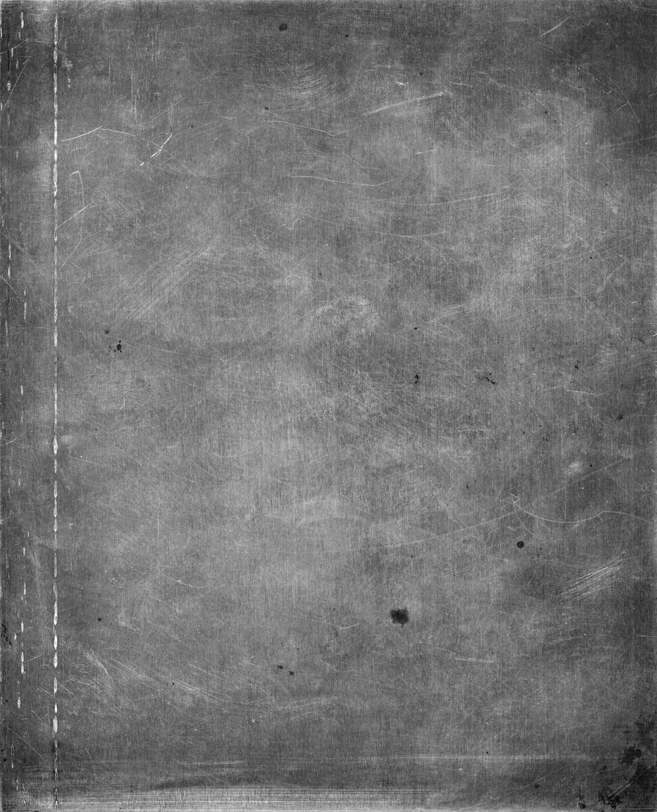
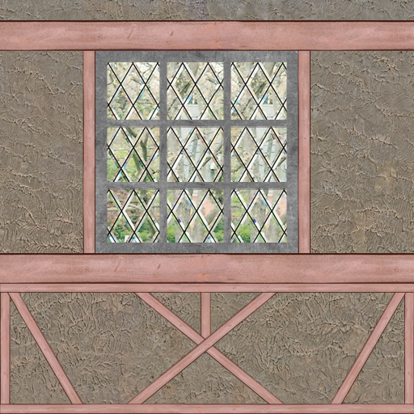
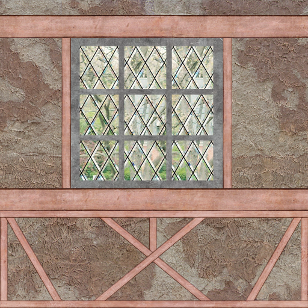
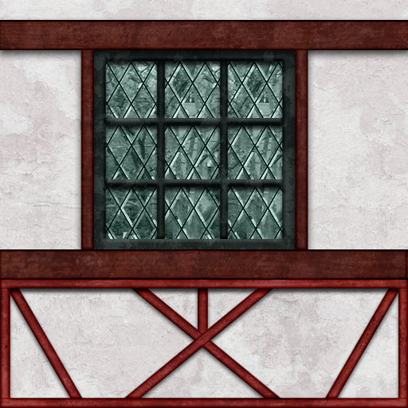

# Basic Architectural Textures

## Conceptual thoughts
Very important when doing architectural textures is having a reference and/or a concept art you can relate to. I always tend do take realistic photos, maybe modify them a bit (like mixing two styles to create a new, unique one).

The big problem you're going to have (especially as a beginner) is that in your imagination things will look totally cool but when realizing the texture and then wrapping it onto a model it will look totally dull and boring. Better stick to something already visualized and the chance it'll look bad are significantly lower.

Now here's the reference I'll be having for this tutorial:

You might already see that in order to save space and filesize this house needs roughly 4 textures (going from ground floor to roof:)

- Grey Bricks
- White-Red Wall Variation 1
- White-Red Wall Variation 2
- Dark Blue Roof

I'll be going for number 2, the White-Red Wall Variation 1.
Now the next thing I do is create a palette with the main colors (using the eyedropper (shortcut: "i" in Photoshop) and the brush (shortcut: "b") and then create a rough outline of the alignment of the different elements of the texture.

[Note: most of the time this already is part of what's going to be my final texture. The rough outline with the main colors is the first layer of the texture, already drawn on the picture with the final size]

As soon as this is done I'll head for a quick analysis of the materials the texture consists of. In this case we're going to need one glass texture, one iron texture, one wood texture and one plaster-like texture. Several "dirt" textures add to this list but we'll come to that later on.

[Note: You don't have to analyze the texture like I did, this is just to illustrate my lines of thought, this is the first time I did this not only in my head. Since it's not that hard to figure out which textures you'll need for which part of the final texture I'm sure you can do it in your mind as well!]

## Gathering the resources

In order to get the texture going you'll need some blanks of course. It's always handy to have a big library of those at hand, but even if you don't have one (yet) you can always start growing one using the multiple sources of the internet. Here are some I can recommend to you:

- Google for the blank you wish and add "texture" as a keyword. (easiest solution, sometimes crappy results though)
- Search http://www.flickr.com/ for a picture containing your element and create a seamless blank from it (needs some advanced photoshop skills)
- Create one yourself (either using photoshop filters etc, multiple tutorials in the internet, most of the time ugly results or you could draw them by hand, that's what blizzard does - given the fact you can draw of course...I can't)
- Buy one of the numerous texture packs out there. Most of them don't come as finished textures but texture blanks, sometimes seamlessly tiled, sometimes not. (Also very easy and timesaving, but most of these packs are pretty expensive)

When selecting textures from your library there's one more thing you have to keep in mind: tiling.

Think about the way your texture will be tiled on the final model. In this case the texture only will be tiled horizontally (left<->right), so we have to either choose textures which are able to be tiled horizontally or make them seamless ourselves.
I'll be doing a tutorial on how to make textures tile seamlessly soon.

Not all the textures reach the side borders on this one though - the glass and iron texture don't have to be tileable in any way.

Some of these images aren't in their original state, I made the plaster texture tileable and the wood texture was made longer (not by stretching but by using the clone tool - photoshop shortcut "s").
The colors all aren't correct, but that's because we're just looking for suiting blanks right now. Images to add realistic structures to our colors.

## Creating the texture

We got the references and we got the resources we need, so we can start working on the actual texture now.

The first descision you're going to have to make is the size. Most of you already know to just use powers of 2 as sides - 128x128, 256x256 or also 64x128 etc as long as both are a power of 2.

But which one is the most suiting?

First choose the proportions, the reference might help you. In my example you can see that one texture is pretty much square, so the file's gonna be square too.

A good general rule for the number of pixels per side is to adjust it according to the maximum size it will be taking on the screen later on: the more you'll be able to zoom in, walk closer etc, the bigger the sides should be.

As for architectural textures 512x512 is the maximum you should go. I'm going for 512x512 as well as you'll still be able to size it down easier than to enlarge it afterwards.

The following steps differ of course depending on your texture, so I'm only able to give you just some tipps on it:

- Work with thousands of layers. Each element gets its own layer. Every "dirt" texture gets its own layer, every color layer is seperate etc. This gives you the most power over each small part and you're able to change things without ruining the whole texture.
- Don't delete parts of textures etc. Sometimes there's a little part missing too much and you'll regret it but can't go back that many steps. Use layer masks instead. That way you're able to crop image parts without deleting them.
- Use lots of "dirt" textures. You'll have to play around with them very much especially at the beginning. Once you've got the hang of it you'll already know which dirt texture'll fit most but there's only one general rule when starting: try it out and then try out some more.
- Use folders. Since you've got lots of layers you can pack them into folders, make several layers invisible/visible with just one click, move them all at once etc. Folders are very helpful if you put the right layers in them.
- Don't forget about Layer Style! You can use it to either create realistic Shadows (Drop Shadow, Outer Glow on Multiply with dark color) or even realistic bevel (if you set the options right) even if you can't draw realistic shadows etc.

Now here's what I did:

## Texture Layout

Using the concept graphic as a reference for proportions etc (by scaling it up to 512x512) I packed the image with the blanks, tansforming them into the right places. I cropped some parts, stretched, rotated them and played with the layer hirarchy.

I also grouped the layers into the 5 colors: DarkRed (Wood), LightRed (Wood), DarkBlue (Iron), LightBlue (Window), White (Plaster)

## Dirt Textures

I copied all the elements inside a folder, hid the originals and merged the copies to one "master" layer. This master layer gives me room to play with settings and also saves time when I want to change a certain value. What's more by holding "ctrl" down while clicking on the image of the master layer inside the layer panel/tab I can select the not transparent values in order to create layer masks.

Now let me explain the term "dirt textures" to you...it's not a texture of dirt, close but not quite correct. You use dirt textures in order to roughen up a structure, make it seem more realistic (nothing's nice and clean, especially not architecture). Anything can be a dirt texture that looks worn. Sometimes dirt textures can be made by simple dirt brushes (black/white) or also using special colored textures.

There's no real general rule about that but it's quite a good guideline to say try sticking to either realistic worn elements that exist in real life as well or use dirt textures of the same structure family as your structure texture (i.e. another wood texture as dirt on wooden parts)

Something you've got to be aware of though: dirt textures can easily ruin your seams! Either choose seamless dirt textures when using real textures as dirt or stick to brushes (or create a seamless dirt texture yourself).

## Coloring

We start by selecting the master layers and hitting "ctrl+shift+u" to completely desaturate them. On top of the master layer I create new layers filled with the color corresponding to the element and set the blending mode to "color" (NOT "hue"!). 

Now the color palette from the beginning comes in handy. Cut it out and paste it into your texture, above all other layers.

In order for the elements to really take the color chosen you have to create a brightness/contrast adjustment layer BETWEEN the color- and the master layer and play with both the brightness and contrast value until the right color is achieved. It's very useful to hide the other parts of the texture while color correcting one (just hide the folder, that's the easiest solution)

Here's what it looks like with the dirt textures, one step further to completion:

## Shadows and the Rest

The last thing to do is adding shadows and some finishing touches like cleaning up the picture, fixing mistakes, refining stuff.

I can't tell you anything on those things except the shadows:

- Use the master layer to add layer styles.
- In order to achieve different shadows on the same element, cut out parts of the master layer.
- Drop shadow is the most obvious tool to use, just be careful to deselect global light, since it'd affect shadows of other layers too
- Other very helpful layer styles are the Inner- and Outer Glow, set to a dark color and "Multiply" blending mode.

And it's finished!

## Credits
Jack