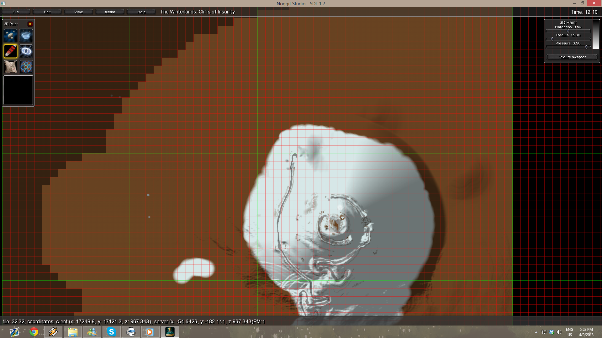
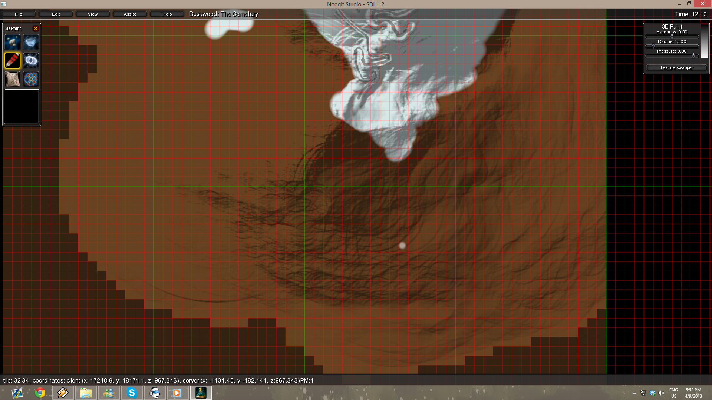
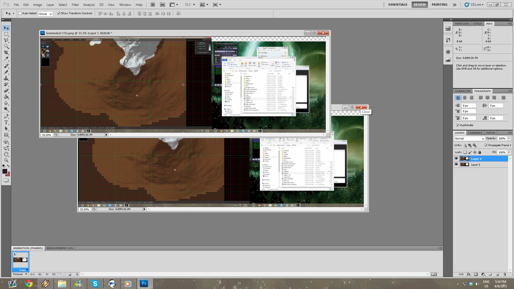
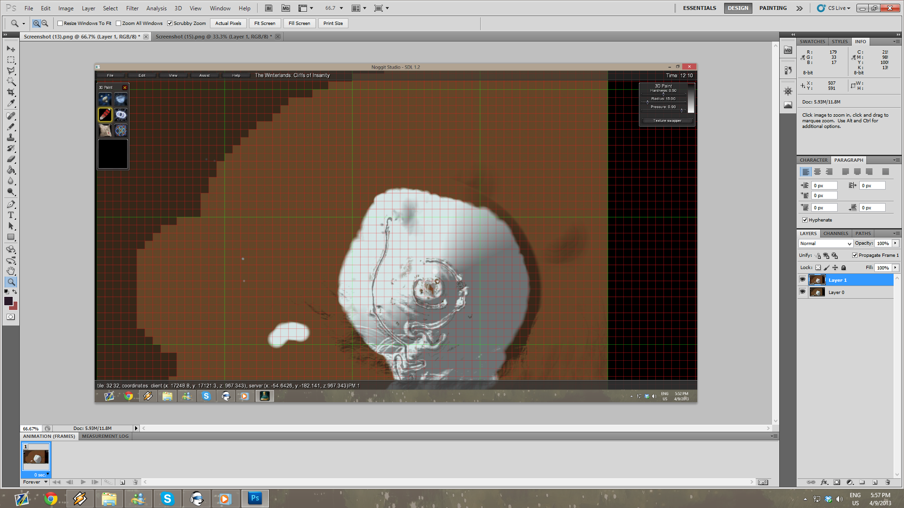

# Creating Minimaps #

Minimaps are small images for every ADT.

First create a new image size 256 x 256 pixels. Save and convert it to a BLP with BLPConverter. The naming convention for Minimaps is a such:

    MyMap2345.blp 

This would then represent the ADT:

    MyMap_23_45.adt

Copy the BLP into your pack folder into the directory Textures\Minimap\. From there extract md5translate.trs, add a new line for your map in the correct alphabetic position to find it again.

    dir: MyMap

Then you must add one line for every ADT that connects the ADT and your BLP.

    MyMap\may23_45.blp	MyMap2345.blp

Make sure that the above lines are separated with a tab and not a space. So in the first line you have your map name followed by a blackslash and the word map. Then add the ADT numbers separated by an underscore. Followed by .blp not .adt. Then a tab, followed by the name of your minimap BLP file.

Save it, and put it all together in an MPQ and test it in-game.

**Note:** avoid using spaces, hyphens or underscores in your instance names. 

## Creating Accurate Minimap Images ##
The first thing you're going to want to do is open the map you're working on in Noggit. Pressing **U** puts you into 2D paint mods. Make sure you hit F7 so you can see the grid, as this is the key to the whole operation. Using Q and E, get as many squares on the screen as you can. While making sure your squares are at least 256 pixels in size. The green lines, not the red. Now take a screen shot with print screen.

Hit F7 and take another without the lines.

Repeat this for the remaining sections of your map.

Bringing both those screen shots into photoshop create an image with two layers.

The top one having the grid, and the bottom without.

Pull up the ruler tool and create guide lines following the green lines on your grid.

Now that the guides are in place, click the slice tool. Find the Slice from Guides tool and slice up your image. You can specify specific names for each of the slices or this can be done later.

From here, turn of visibility on the first layer so your grid lines are gone and choose save for web and devices in the file menu, saving to PNG. You'll end up with some extra images that you can't use, just delete them. After that you can either resize each image individually to 256x256, or use a batch processing tool like XnView. Now you can begin constructing the Minimap as per above.

## Credits
Valium