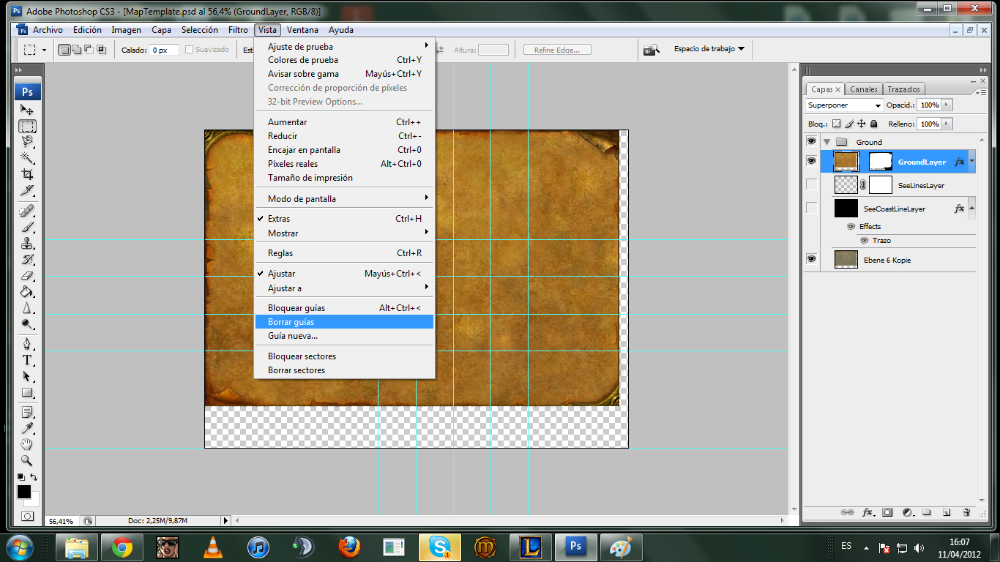
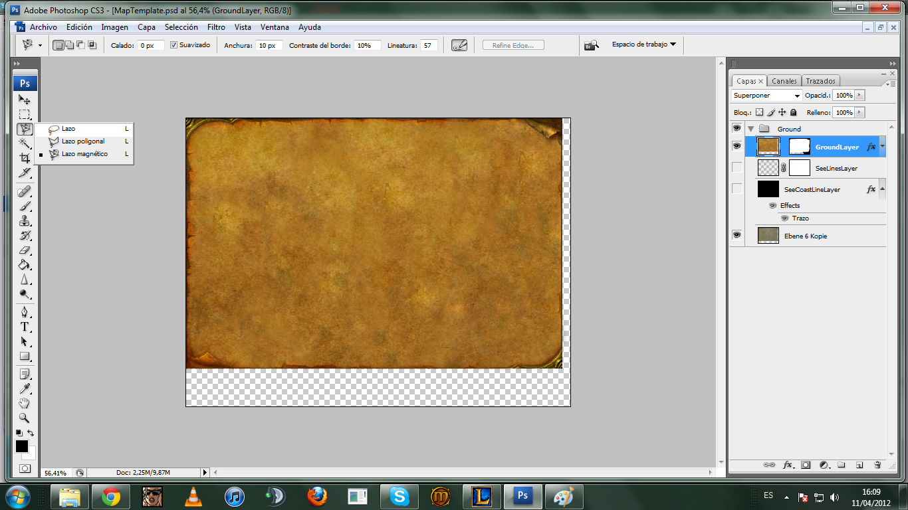
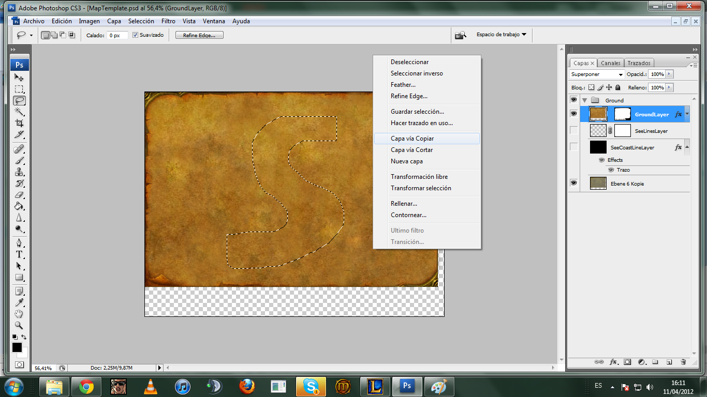
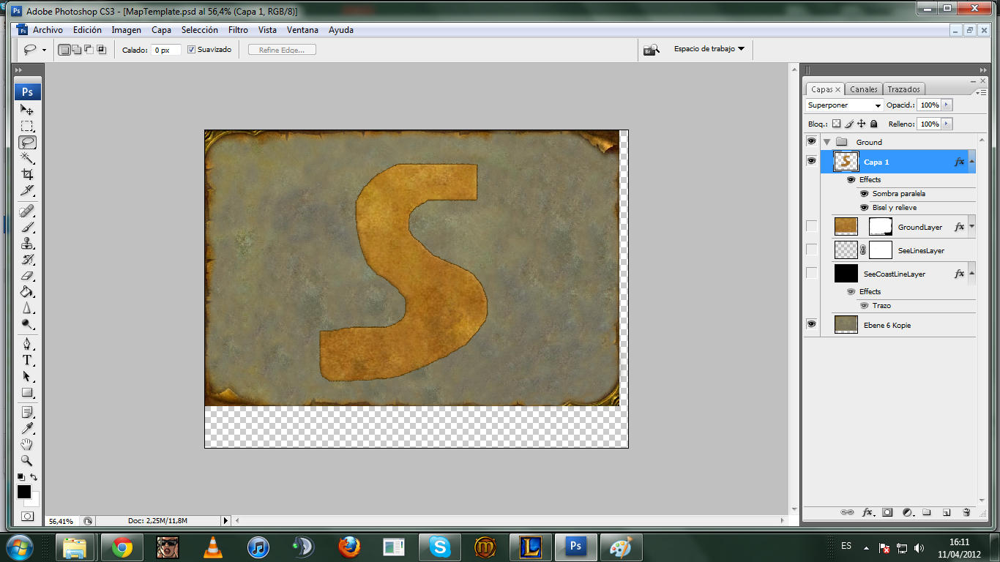
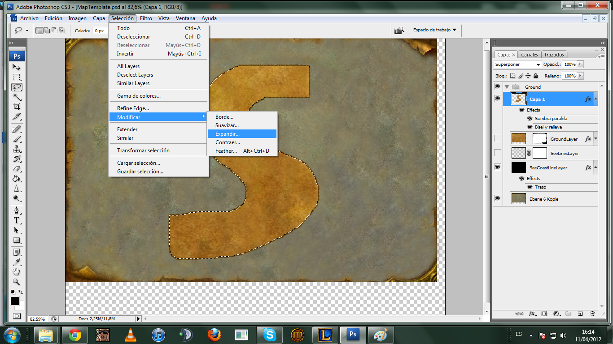
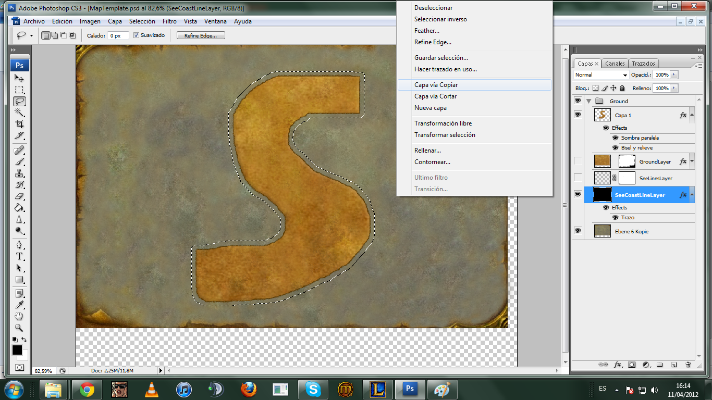
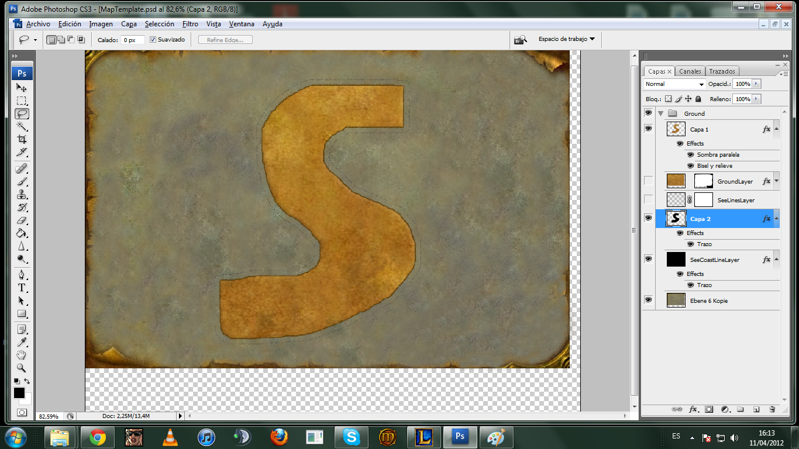
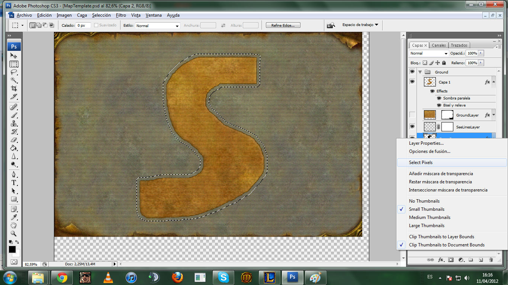
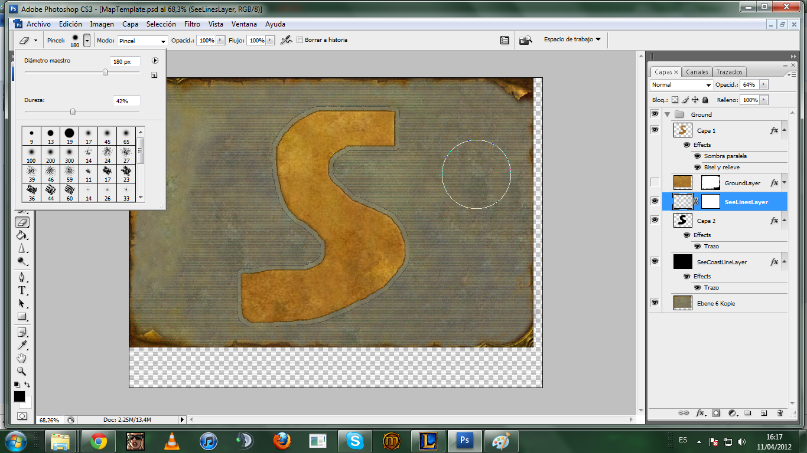
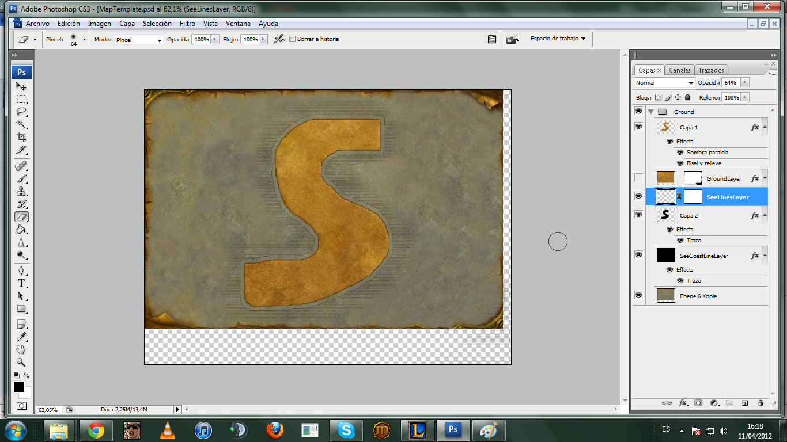

# Custom World Map

The starting psd file: [MapTemplate.zip](files/MapTemplate.zip).

You will see the blank map, and a few guide lines ontop.

What we want to do, is delete the guidelines, so they don't interfere while designing our map. Follow the screenshot; (My photoshop is in spanish, so where you see "Vista", it's "View" and "Borrar Guias" is "Delete Guidelines")

What you have to do now, is select the "Lasso Selection Tool", the third on the tool bar.

And then you want to draw out your map. I decided to draw an S for tutorial purposes. You will have to draw the land you made via noggit. Once you have the land selected, you have to right click, and choose "Copy via Layer" and then, to see your cut out land, you will have to toggle the "Visible" option off on the layer.

Which will leave you with: 

Now, what you have to do is make the coastline, so we have to select the pixels of the island that you just made by rightclicking the thumbnail photo of the layer on your right.

Once selected, you have to go to Select, Modify, Expand, and expand the selection 12 pixels ( You can play with this number, either make it bigger, or smaller).

After you have the expanded selection, you MUST select the "SeeCoastLineLayer" below (The Black thumbnail). Once selected, right click your island, and once again "Copy via Layer".

If you have done everything correctly up to now, you will be left with your island, and a black line that you can barely see at the same distance you expanded from the island (12px).

Now, since you can barely see that black line, I (PERSONALLY) prefer to put the opacity up a little bit on the stroke, in other words, the effect that is on the layer, in spanish called "Trazo". You can double click it to get the options window open. Then you can drag the bar to the opacity you feel like.

What we want to do now, is define the coastline. So what you have to do is toggle visibility on the "SeeLinesLayer".

Go back to your "Layer 2" (The one you put the opacity up on), and select the pixels.

Then, *IMPORTANT* go BACK to the "SeeLinesLayer" and make sure you are clicking this layer, and then press delete. This will clear the water of lines between your expanded selection and the island.

Now, on this last step you have to rub out the rest of the "SeeLinesLayer" with the rubber. But remember, to leave a decent amount of lines around your coastline, so it looks "blizzlike" ^^.

And, if you have done everything correctly until now, you will have your final result!

## Credits
Soldan