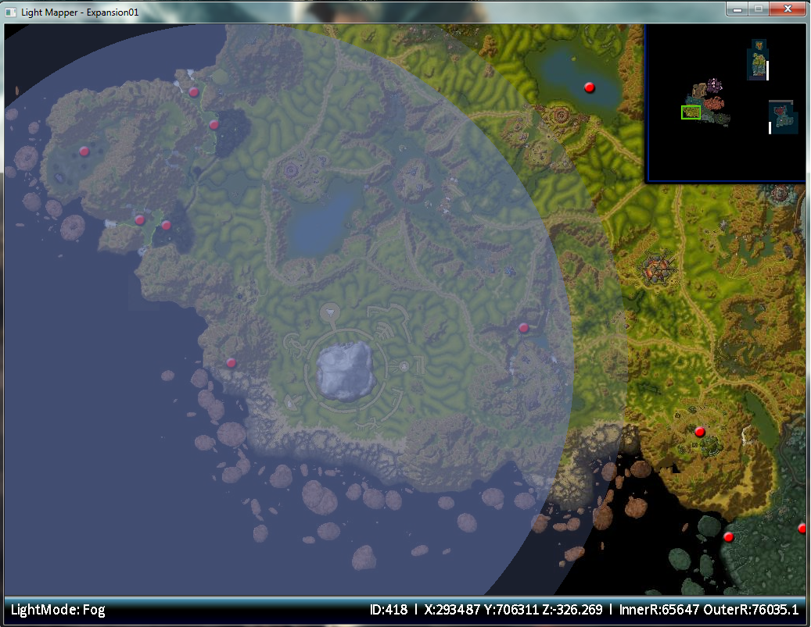
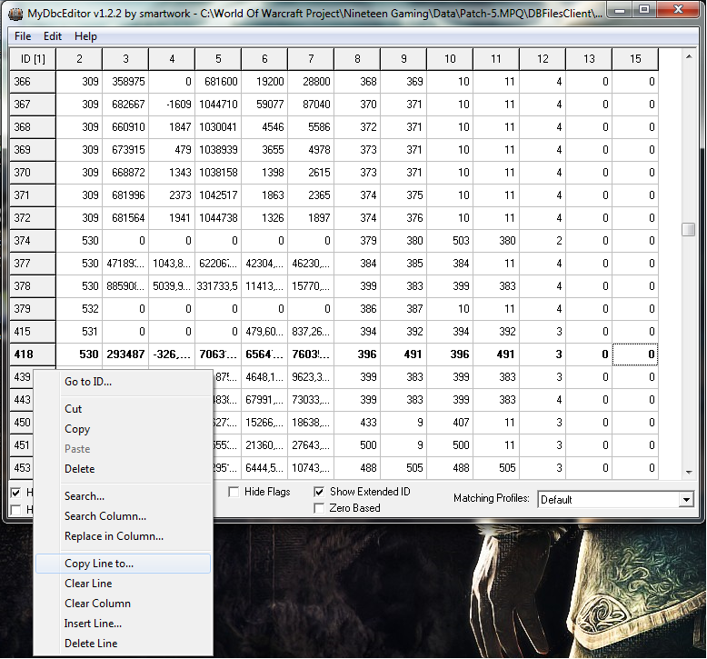
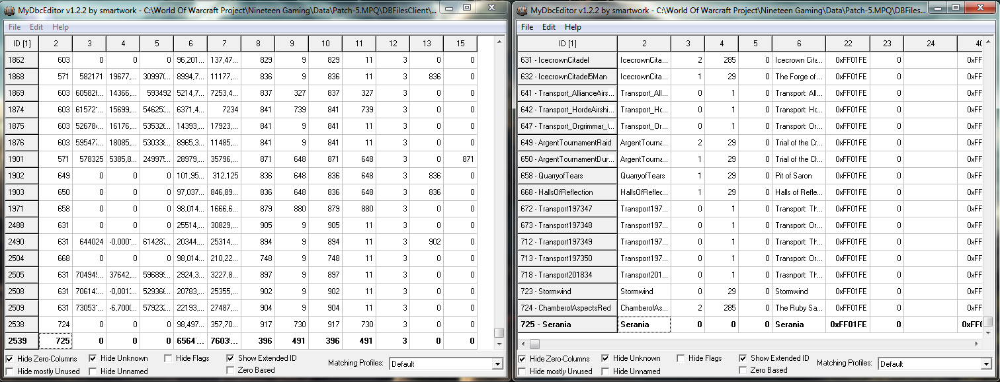

Today I'm going to explain how to copy existing light setting to your own custom map. **Note**: This will only work if you only use one light source.

## Requirements
* MyDBCEditor
* Lightmapper

## How To
The first things you will need to do is decide which light settings you wish to copy. Once you have located that zone within World of Warcraft is it time to open Lightmapper. For this tutorial we are going for Lake sunspring in Nagrand.

Within Lightmapper navicate to the correct zone and search for the light.dbc entry (A red dot on the map) that is controlling your desired area. Memorize that ID number.

Head over to MyDbcEditor and open Light.dbc.
Search in the first column for the ID number we have found within lightmapper.

Right click on that ID line, Copy line to... and enter the last ID (of column one) plus one.
(Last ID is 2156, You enter 2157)

Edit column two to your map ID that can be found within map.dbc
Edit Column three, four and five to 0

**Left**: Light.dbc **Right**: Map.dbc

Save light.dbc and place it within your your DBFilesClient folder inside your patch folder.

Succes! Your custom map should now have the copied light settings.