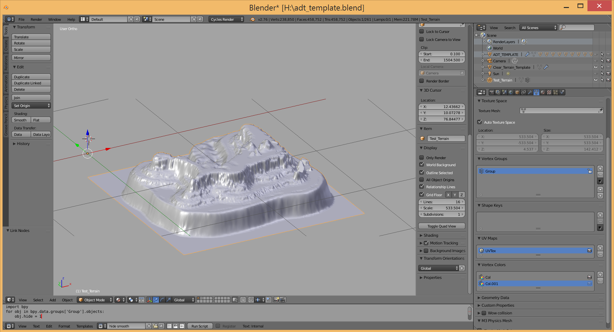
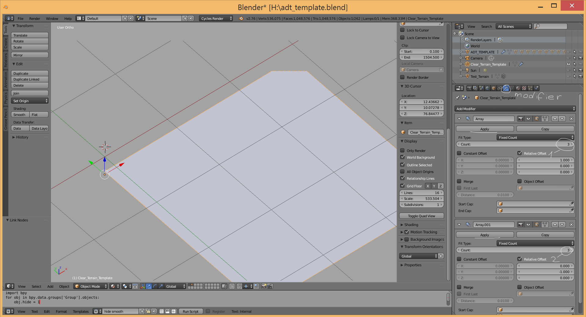
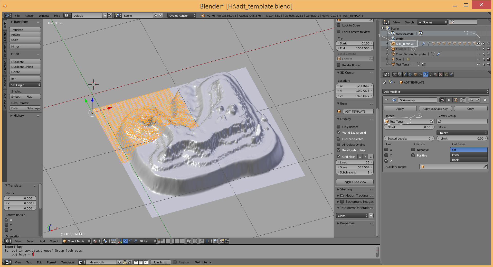
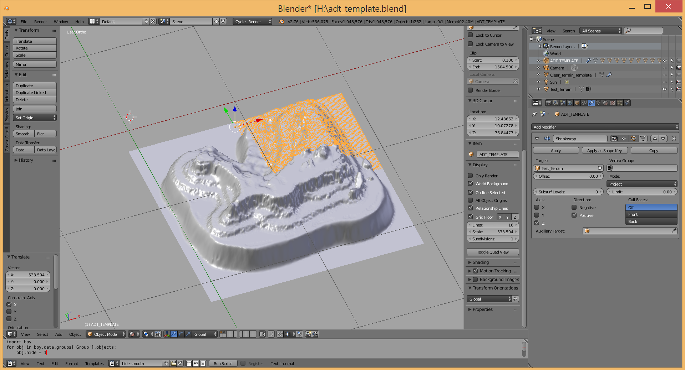
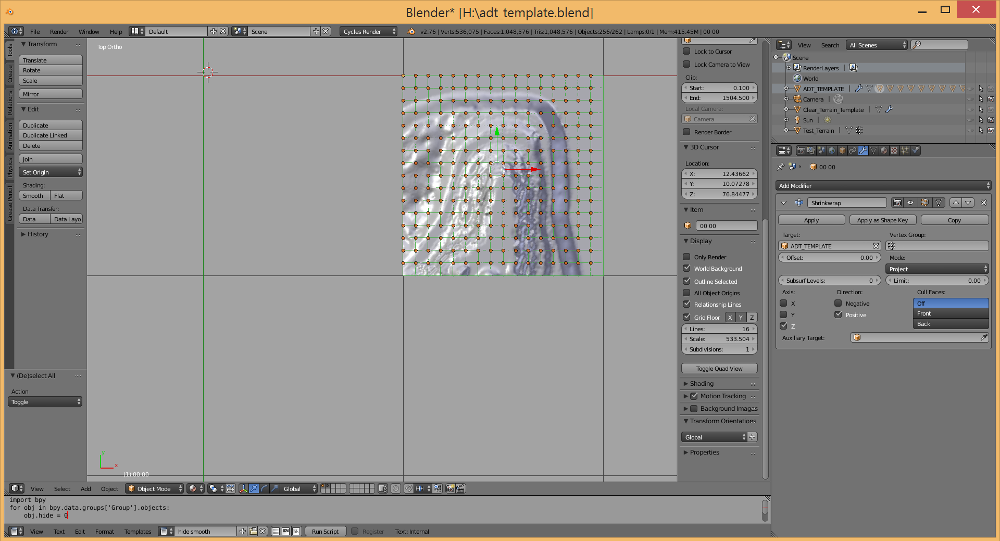
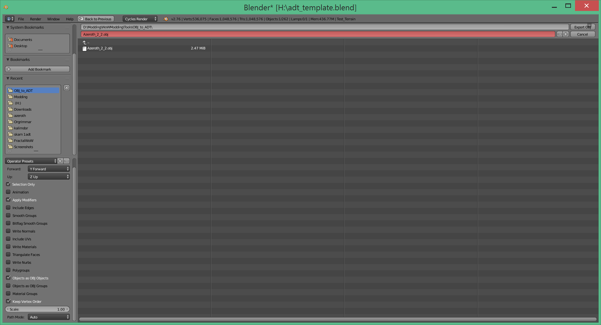

So firstly you need to download the ObjToAdt. it's a java app so you also need to setup java on your PC. In the comment section of this tool you can find adt_template.rar so download it too and extract it somewhere.

When everything is ready run blender and open up adt_template.blend in it. You will see something like this:

So in the outliner panel you can see all of our objects and if you wanted to start sculpting your terrain then you need to follow those steps:

- Select object that named as Clear_Terrain_Template
- Switch to modifiers panel
- Set number of adts you want to have in a row (1)
- Set number of adts you want to have in a column (2)
- Hit apply on both modifiers
- Swith to Sculpt mode and start sculpting

When you are ready with your sculpting then you need to:

- Select ADT_TEMPLATE object (1)
- Make it visible (2)
- Go to modifiers panel again and in target select your sculpting. This time we don't need to apply this mod (3)

Now while holding ctrl drag ADT_TEMPLATE by X and Y to place it in needed position( better to do this in top view)

Then select all objects by pressing A key(two times actually, one for deselecting all and second to select all) and press H key to hide them. Then at the bottom you can see some script. Change 1 to 0 in it and press Run Script button. 256 objects will appear here. Select all of them (A key) and export to obj.

Export settings:

