In this tutorial I'll explain to you how to clone particles from a model to another one with the help of ParticleCloner, a tool made by Tigurius. This tool is old, so it doesn't work with Cata+ models since the structure of the m2's has changed. I didn't tried with spell models from Cata and up (only doodads or creatures), maybe it's different and it can work, but not sure.

Edit: It can load WoD or Legion models, but it's pretty random, if the models are similar it can work, sometimes not, just do some tests and try.

## Tools
* ParticleCloner
* 010 Editor with M2 Template

## Process

First, choose the particles you need in WowModelViewer on the model that you want.

For this tutorial I choose particles from the spell Arcane_form_precast.m2 to put on 2 models, one without bones or animations, and one with both : misc_2h_pitchfork_a_01.m2 and sheep.m2 .

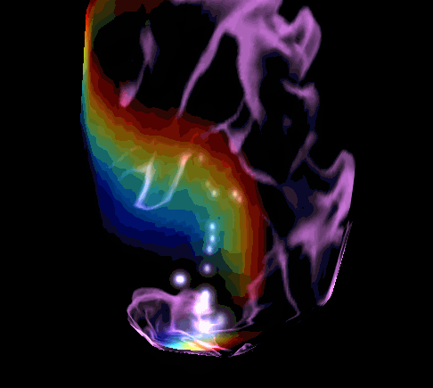
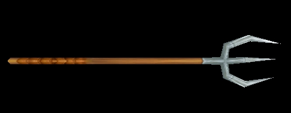
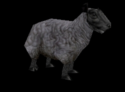

To make the transfer, select first the "destination" model, CTRL+ left click to select the second "source" model and drag&drop on the application. (Always do backups if you did it in the wrong way, this program overwrite the original file ! )

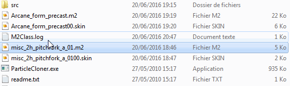

When it's done, you'll have the particles at the same place of its original model.

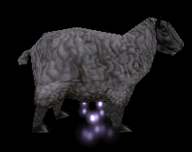

Now, you certainly want to move the particles to the right place.

Open the m2 with 010editor and load the M2 Template. Go to the end of the file at the line " struct Particle ". You'll have all the informations you need, the attached bones, coordinates, etc...

Particles have the bone from the original model, for a simple animation like this, there's only one bone. For this fire, there's three elements (flames, smoke and sparks), so there's 3 bones. I used it for a Sargeras model.

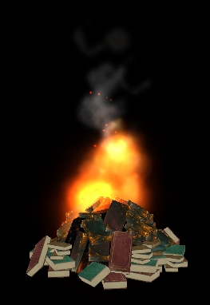
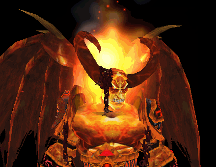
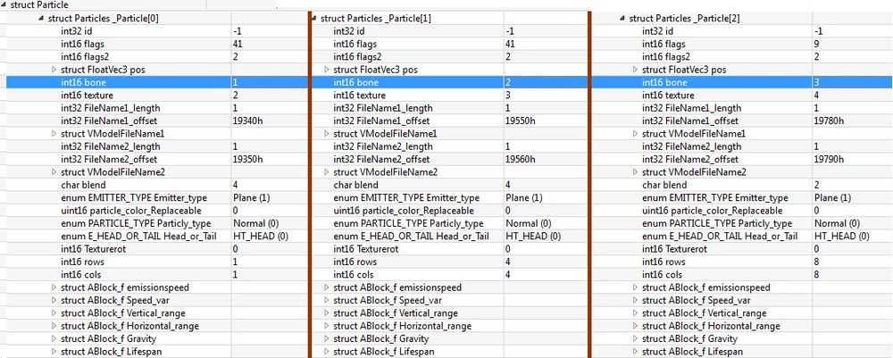

You have to set the number of the bone where you want the particles to be. To move it to the right place, go to the " struct FloatVec3 pos " line. As you can see on the picture above, I modified the values on the x axis.

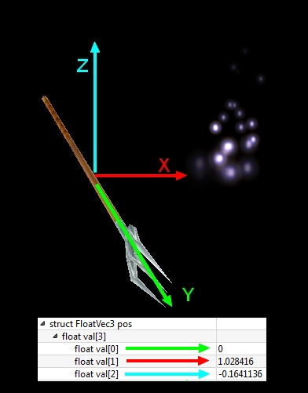

You can change what you want to have the good coords. Just try and retry with the help of WMV to visualize the result. For the sheep, I set the particles on bone 3 who's attached to the head.

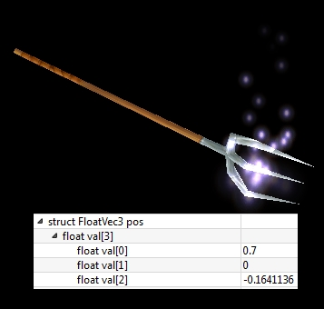
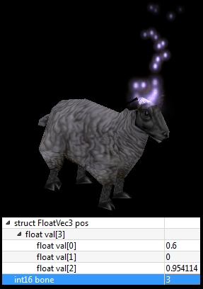

This tool can copy the texture path of the BLPs used by the particles.

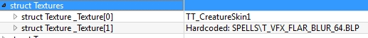

But when you'll go ingame to see if it works, you'll have little cubes instead of the texture. WMV can load them, but not WoW.

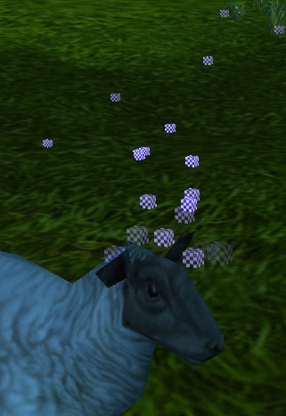

Why ? Because the tool does some mess too. In the " struct VModelFileName " 1 & 2, you have random symbols at " struct filename texture > string value " . Delete all and reload the template, or save and close the model. Do it for each particle in your model.

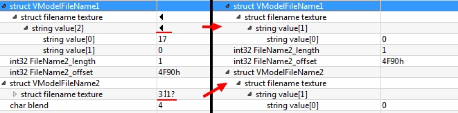

And it's finally done ! Good job, you can manage particles !

**PS:** for unknown reasons, my fork is invisible ingame after I added the particles on it. Maybe because the model doesn't have enough "informations" in it because it's a little model, or because there's no bones in the original model. I don't know. Maybe one of you will find the solution ?

## Credits
Met@