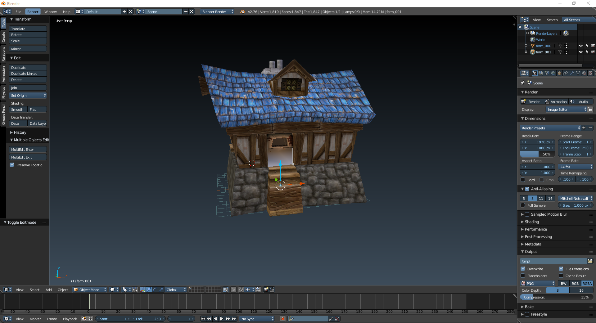
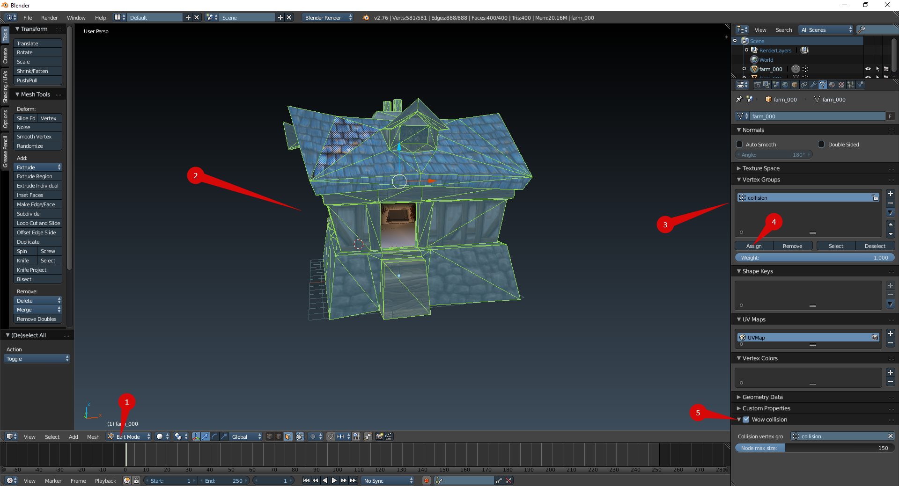
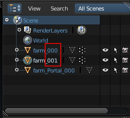
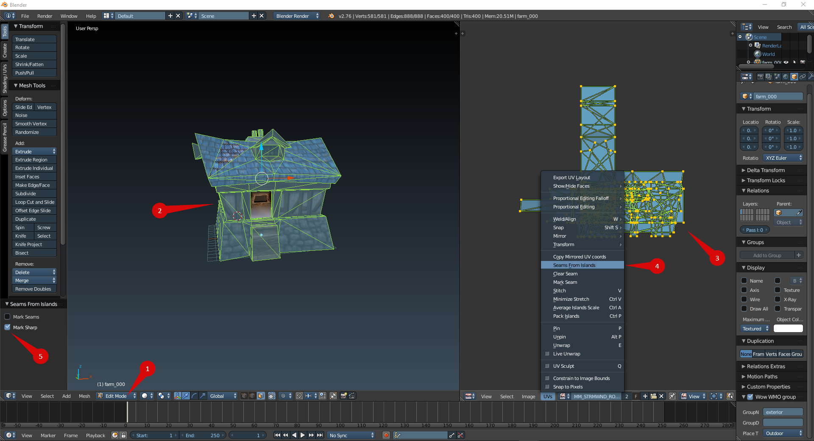
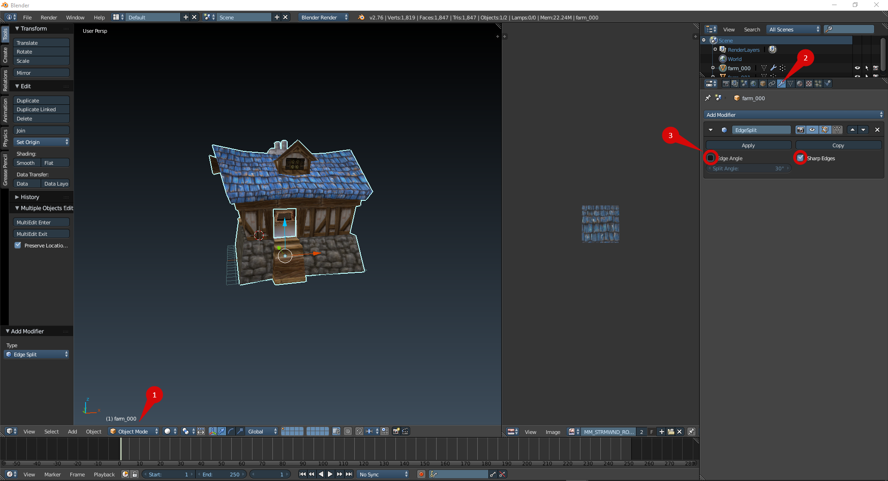

Hello, Model Changing Network. In this tutorial I want to show you how to edit and create WMO models using Blender and happyhack's WMO scripts.

## Requirements
Here is the list of tools that are necessary for creating WoW World Model Objects (WMO):

* Blender
* WMO import/export scripts

## Installing scripts and configuring your Blender
Download and install Blender. For the current moment the latest Blender version supports the scripts. Download happyhack's scripts and place them into addons folder inside of your Blender folder.

    Blender\x.xx\scripts\addons\io_scene_wmo\

It should look this way. 

Now start your Blender and head to File -> Blender User Preferences -> Add-ons -> Import-Export and enable the WoW Wmo format (.wmo). Hit "Save User Settings".

Now you are able to export and import .wmo models right from your Blender.

## Basics and peculiarities of WMO editing using Blender

Those scripts are designed in quite a special way and it would probably be better to import some existing .WMO model from WoW to learn how to do things because the WMO from WoW will be already configured correctly by itself. For this purpose I am going to use a small human farm house. Before importing it you need to have all textures as .png images in the same folder as the model (subfolders are not needed, all in a plain way), otherwise the model won't have textures displayed.

In this tutorial I won't explain how to model things. I will just tell you how to make them work as a .wmo in the game. I will cover the unusual parts that are different from the normal Blender usage.

### Materials
Those scripts do not support Blender materials or texture maps. They use their own special material properties called "WoW material" which are bound to Blender materials. There you can specify the texture you apply to the model by setting a path to it and a few other less important settings:

* **Transparent**  - the so-called ghost material. Makes the geometry invisible. Very useful for creating invisible walls and smooth collision for ladders.
* **TwoSided** - one-layerd geometry can be seen from both sides just like two faces facing against each other. Useful for thin things like vegetation details or ropes.
* **Darkend** - darkens the texture. Usually used on windows inside the building.
* **NightGlow** - makes the texture glowing at night, Used for windows and lanterns, mostly in outdoor groups (can still be used anywhere).

There is a way to assign a texture to geometry in Blender without using materials. This won't work. So in order to assign the texture to the geometry you need to assign a usual material to it, go to material properties, find a tab called "WoW Material" and specify the needed settings there.

When you assign and tweak all of them, the textures will be visible in the game.

### Collision
In order to create collision for a model you need to go to object data while being in Edit mode, select the geometry you want collision in and assign it to the vertex group called "collision" (if it is not there create it). Then check the "WoW collision" tab in the bottom.

### WMO Groups
World of Warcraft WMO supports two group types - indoor and outdoor. Outdoor is used for exterior objects and is influenced by the zone lighting. Indoor is used for interior models, interior parts of models. It is not getting influenced by the external light. If you are planning to use indoor groups in your scene you will have to create portals for them. I will explain how to make them later.

So, for setting group types, select every object one by one and set checkbox to "WMO group" and also specify a type of the group.

In the same preference tab you can also see various settings:

* **GroupName** - anything you want. Useful for marking the groups, so it would be easy to find them if you ever need to have a look to the model structure, for example, in 010 editor. Please do not name as "Antiportal", internally reserved name that actually makes sense for the game.
* **GroupDesc** - Group description. Anything you want.
* **DBC GroupID** - connected with AreaID for WMO. Used to detect indoor groups for example, so server can dismount you when you enter them.
* **Vertex shadin**g - enables vertex color export.
* **Use skybox** - enables skybox in particular group. Skybox path is set on export.

### Portals

Portals are used to connect indoor groups to outdoor groups or other indoor groups. If the portal is not set but indoor group is used, you will have the indoor group rendered only while standing in it, everything else will look like emptiness.

A portal is a plane that contains only 4 vertices and one face (polygon, not two triangles). Portals are created as separate objects (you can see them in outliner if you import some original WMO like I did with human farm).

Once the object is selected you can set a checkbox in "Object data" tab to enable portal settings and mark the object as a portal. Make sure that portal does not have "WoW collsion" and "WoW WMO group" checkboxes enabled, we need only "WoW Portal Plane". 

Here you see two options: "First GroupID" and "Second GroupID" which are parent and child WMO groups. They can be indoor-indoor or outdoor-indoor. Which one comes first is not really important apparently. There is no need to create portals between two outdoor groups, but I guess you can do that too. Those ids are the number of the required group in the outliner list.

It is easy to find when you are working with a freshly imported original model. Though, in process of modelling those object names get messed up. In order to free yourself from calculating the number of the object manually by counting them, just export the scene and import it back. All the groups will be renamed properly.

If the portal is bugged ingame, use checkbox "Invert direction". For most cases the script detect direction automatically but in some rare cases you need to invert it. Just do for the bugged ones after checking the WMO ingame.

#### Creating Custom Portal Geometry
There is nothing complicated in making custom portal geometry. Though remember that it should be precisely on the edges that connected groups share. So, for this door it will be this place (I painted two groups indoor and outdoor in two different colors for visual purposes):

If you move the portal from that point it will be bugged in game on camera rotation. Be careful with that.

So, in order to create a correct plane for a custom portal select one of the groups. Simply select 4 corner vertices and press "F". It will generate a plain between them. Then select this plane and press "P". In the opened menu choose "By selection". It will detach the plane to a separate object, so you can fill in the settings.

### Vertex Color
You can paint vertex colors on WMO groups. It is used for lighting particular places of a group. For doing that switch to "Vertex paint" mode. You can learn it by practice or by using some Blender tutorials or documentation. Though, I will tell you two important things about it. You can paint colors and you can fill everything with colors. For filling, pick up a color and press "**Shift + K**". 

Indoor groups should always have vertex color, else the game crashes. So make sure that "Vertex shading" checkbox in "WoW WMO group" settings is enabled. If you group (either indoor or outdoor) has no vertex color data, but you set a check box, the model will be pitch black in the game. Be careful about it.

### UV Mapping Bugs
In order to avoid UV mapping bugs while using those scripts do the following procedure after you are finished working on your model.

Select one group of your model, switch to Edit mode. Select all geometry (**A**). Open "Image/UV editor". Select all UV coordinates there (**A**). Open a tab "UVs" and select "Seams From Islands". In the appeared windows select only "Mark sharp". 

Now switch back to Object mode. Open "Modifiers". Add a modifier called "Edge Split" and uncheck "Edge Angle".

Do the same process for the rest of the groups.

Other means of editing are the same as if you use Blender with regular models.

### Export

Export

There are some export settings to be observed when you are ready to see your awesome model in the game:

* **Operator presets** - allows you to store "favourite" export settings for WMOs.
* Use ambient - enables ambient lighting (indoor groups). The ambient color is defined below.
* **Fill water** - makes you WMO fully filled with water. Useful for underground caves. Note that exterior parts will be "sunken" too.
* **Save source doodads** - preserves the m2 doodadset that was imported along with the model.
* **Save source fog** - preserver fog settings imported with WMO.

Thanks for reading! This tutorial is relevant to the recent version of WMO import/export scripts for Blender. If the script gets updated, the tutorial will be updated too.

## Credits
Skarn

## Links
* [MC.Net](http://www.model-changing.net/tutorials/article/76-creating-or-editing-wmos-in-blender/)