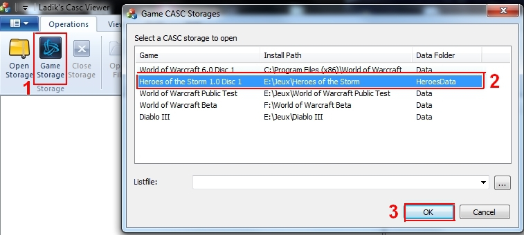
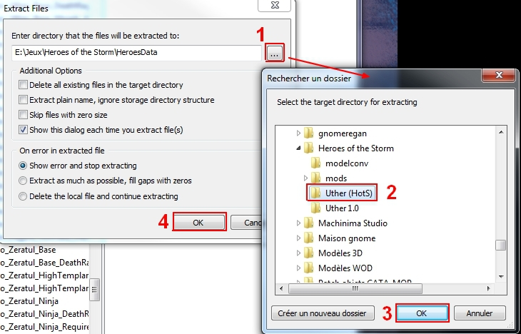
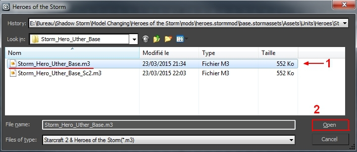
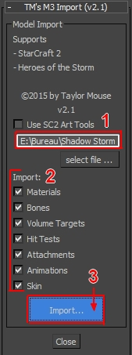
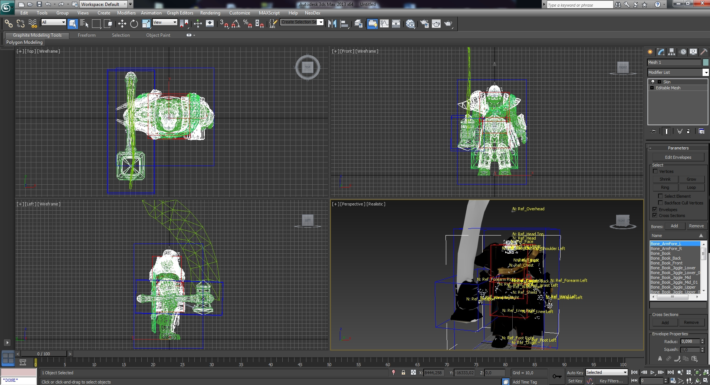

# Import M3 Heroes of the Storm to Blender

## Tools

- CascView
- Blender
- Addons for Blender (links in the section dedicated to this program)
- Heroes of the Storm game folder
- 3DSmax 2012 and up (for the second technique)(if you take a lower version, you'll need an older plugin)
- M3 Import v2.1 for 3DSmax

## Extract models from the game
First, you need to have the game installed.
Open the Casc Viewer, click on Game Storage, and select your game folder.

Now, explore the folders and choose the model that you want. In my case I'll take Uther.

Now, right-click (or F5) on it to extract the model.

Choose your folder and save it.

## Direct to Blender
I've searched on the web after some plugins for Blender, but have not managed to make them work. Some are too old, others not compatibles, etc...

The new M3 file format from HotS is a little bit different of M3 files from StarCraft, so SC modders are using a converter to make the models compatible with their tools..

* Heroes M3 To Sc2 M3 Converter

Here's some M3 blender plugins, maybe you'll have more chance than me to make them work:

* **m3_import** by muraj is 5 years old, so I think it can possibly work with older versions of Blender.
* **m3addon** by flo seems more complete and more up to date.
* **blendm3** by stante is normally compatible with the 2.71 version.

Sadly, no one was working for me (and I don't have time to test all blender versions with all plugins), so I've chosen the second solution.

## To Blender with 3DSmax

### 3DSmax
I don't really like this program for now, I have not taken the time to understand all the tools, but I can use it for simple things.

So first, open 3DSmax. Click on the MAXScript pannel and choose Run Script.

In the new window, you'll see the scripts that you can run. You can just drag and drop the M3 addon in this folder, or add it manually in your program folder (in my case " C:\Program Files\Autodesk\3ds Max 2013\scripts " ). And open it.

Go to the right side of your screen, in the tools section. Switch to Utilities and click on MAXScript.

Scroll down to see the new pannel called TM's M3 Import (v2.1) and choose Select file.

Choose your file and open it.

Once your file is selected, check what you want to keep in the model (bones, animations, etc...) and import it.

Now you have your model.

You can export it in *.obj file, click on the Autodesk logo and choose export.

Choose a name and the file format to open in Blender later.

### Blender
Now launch Blender, go to import option and open your file. And here it is ! In my case, I have a blue pill (hitbox). Your *.obj will be like a *.fbx, it will keep all the informations like materials, bones, and animations. Just keep and remove what you want.

And voilà.

After that you can work on the modell as you wish. Let's paint Uther with abdalrahman9's technique. (all the red is the material color, not the weight paint)

And I rework the face to fit well with the human model.

## Credits
Met@