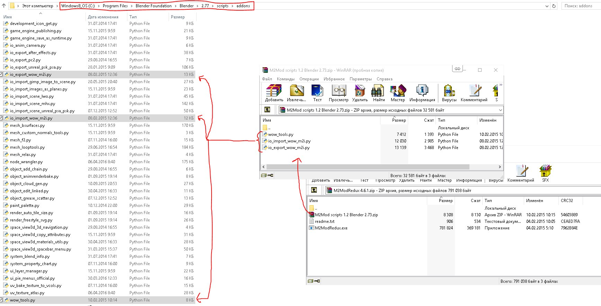
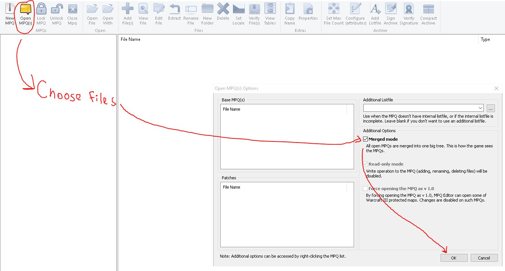
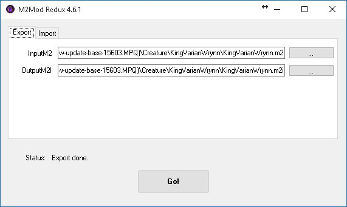
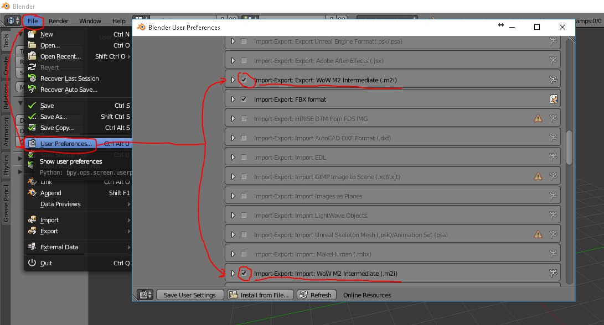
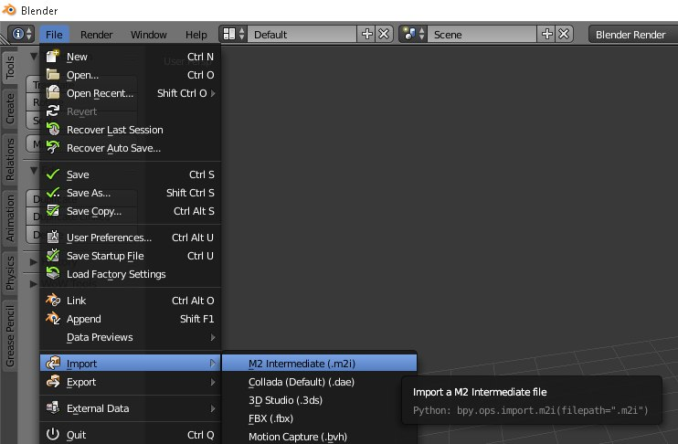
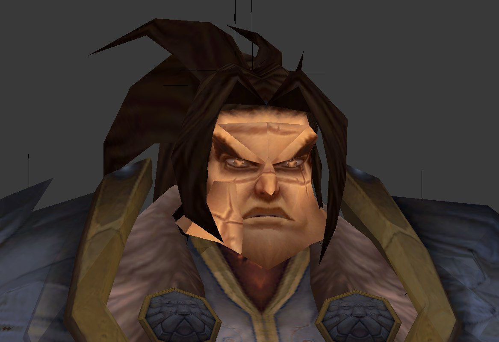
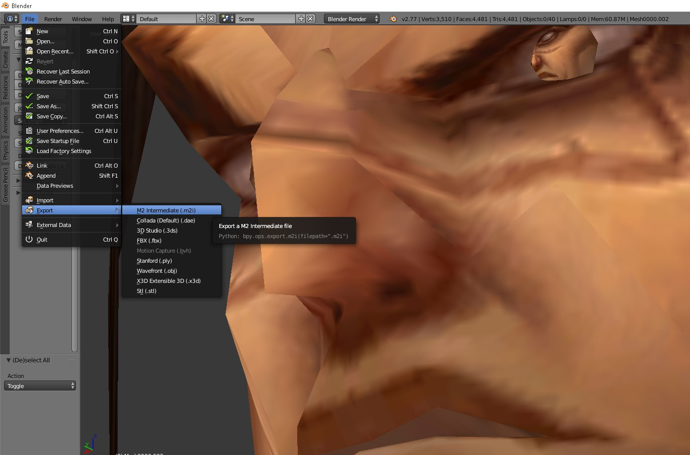
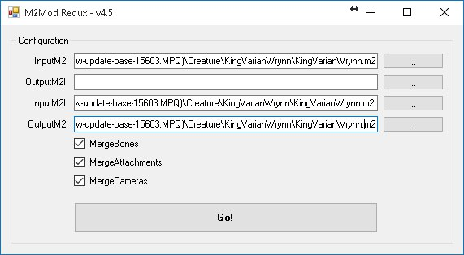
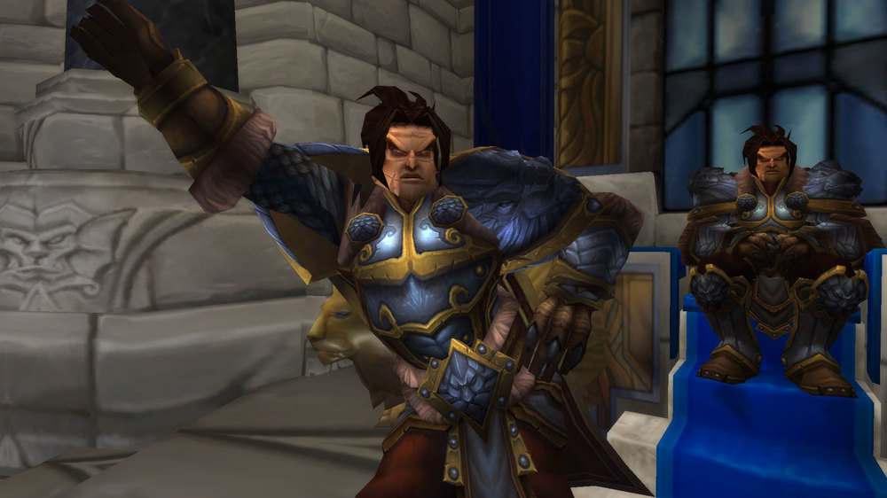

So, you are a newly made WoW modder, full of energy and amazing ideas! Even if it's not like that, I will assume it is. And, you want to edit an existing WoW model. Unfortunately, there are no tools yet that would allow you to edit an M2 directly, so it has to be converted into an editable format and then converted back. That can be done with M2mod, and after you've read this tutorial, you will be able to perform this incredibly complicated algorithm on an expert level.

This method is confirmed to be working in Cataclysm and Mists of Pandaria, and, possibly, in Warlords of Draenor and Legion.

- **Blender 2.77**
- **M2mod Redux 4.6.1**
- **M2mod Redux 4.5** (yes, you need BOTH versions of M2mod Redux) (they will be further referred to as simply M2mod 4.6 and M2mod 4.5)
- **Ladik's MPQ Editor**
- **Brains** (I use version 0.0.2 alpha, but it's not necessary anyway)

## Installation
Download everything listed in the "Tools and resources" section.
Install Blender. Extract the archives of M2mod 4.6 and M2mod 4.5 (in different folders, obviously).

In the extracted M2mod 4.6, there will be another archive inside called "M2Mod scripts 1.2 Blender 2.73.zip". Move/copy it's contents into your Blender folder\2.77\scripts\addons\ (the default installation path is C:\Program Files\Blender Foundation\Blender\2.77\scripts\addons).

Proceed to Model Extraction

## Model Extraction
Choose the model you want to edit. You can use WoW Model Viewer for that, but I can't make the tutorial that detailed. Let's say I want to edit Varian Wrynn's model to make his chin even more brutal.

Open Ladik's MPQ Editor, select all the MPQs in your WoW\Data folder, tick "Merged mode" and press "Ok". Wait for the files to load.

Find the location of the chosen model (in my case it is Creature\KingVarianWrynn). Extract the model and the .skin files related to it: select the files > press RMB > choose Extract > enter the desired directory > press "Ok" > wait for the filex to extract.

Proceed to M2->M2i Convertion.

## M2->M2i Convertion
Open the folder with M2mod 4.6 and launch M2ModRedux.exe.

Choose the "Export" tab. In the InputM2 field browse the path to your extracted model and choose the .m2 file (in my case it's KingVarianWrynn.m2)

Imagine you are launching a thermonuclear bomb at your least favourite person in the world and press "Go!". Wait for the Status to say "Export done".

Proceed to Modeling

## Modeling
Open your Blender folder and run blender.exe

Go to File > User Preferences > Add-ons tab > find "Import-Export: Import: WoW M2 Intermediate (.m2i)" and "Import-Export: Export: WoW M2 Intermediate (.m2i)" > tick both of them > press "Save User Settings" > close the Blender User Preferences window.

Go to File > Import > M2 Intermediate (.m2i) > find the converted model from M2->M2i Convertion, step 2 and press "Input M2i"

Edit the model however you wish. 
Through hard work and skill, I made Varian look even more brutal than he was.

Go to File > Export > M2 Intermediate (.m2i) > choose the path you want > press "Export M2I".

Proceed to M2i->M2 Convertion.

## M2i->M2 Convertion

Open the folder with M2mod 4.5 and launch M2ModRedux.exe.

In the InputM2 field browse the path to the original model (in my case it's KingVarianWrynn.m2).

In the InputM2I field browse the path to your edited model (in my case it's KingVarianWrynn.m2i).

In the OutputM2 fiels choose the path and name of the new model (I'll just replace the original KingVarianWrynn.m2)

Imagine you are launching a thermonuclear bomb at your least favourite person in the world and press "Go!". There is no Status, so just wait.

Proceed to Patching

## Patching

I assume you know how to compile a patch using Ladik's MPQ Editor.

Enjoy your edited model!

