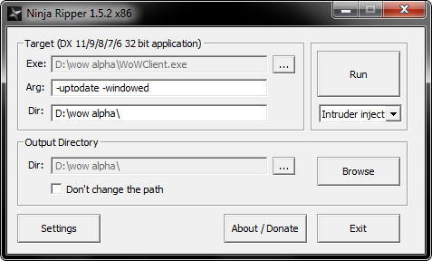
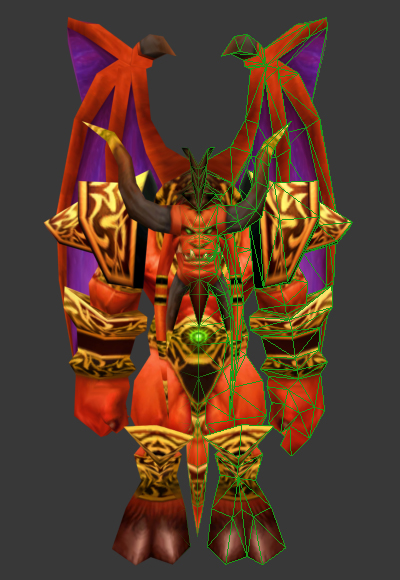

Hello Everyone. Many people have been asking me how I ripped the female troll from classic WoW alpha. Here is the tutorial. If done well, only takes 5 minutes. With this method you will be able to extract only the geometry. It doesn't work for particles or animations.

Tested in WoW alpha version 0.5.3.3368.

## Tools
* MPQ Editor
* 010 Editor
* WoW Alpha T-Pose Forcer
* Ninja Ripper (1.5.2 is fine)
* 3D Studio Max

## T-Posing
First of all, you need to extract the model you want to rip with MPQ editor. Wow Alpha models are in MDX format, quite similar to Warcraft 3.

Open the model in 010 editor and run my T-pose script. This script leaves the model with just 1 animation (if you remove them all, the game crashes), and changes its animation interval to 0. This will set the model to its default unanimated state, making it symmetrical and easier to animate.

Once your model is T-posed, you have to put it back in-game. WoW alpha has local directory loading allowed, so it's quite easy. Just open the "Data" folder inside your WoW alpha client, make new folders following the original model's path and put the mdx inside of them. It's a classic model swap. You can test the model in-game if you want.

## Ripping
Now that the model is unanimated and T-posed we can proceed to rip it. Open your server. Set the starting zone to Eastern Kingdoms. If the game is opened, close it.

Unzip Ninja Ripper. Go to the folder called "x86" and open NinjaRipper.exe. In "EXE" select "WowClient.exe" inside your game folder. In ARG type: -uptodate -windowed

It should look like this:

Click "RUN". The game should open. Log-in (you have to be morphed into the model you want to rip) and open your command line (pressing "~" or "Ñ"). Teleport to the following coordinates: `worldport 0 -9999 -9999 22` (this code is for the Abyss2 emulator, it may be different in other emulators)

Why do we teleport to these coordinates? Because Ninja Ripper extracts every single model on your screen, and we need an empty environment to avoid a model overload.
Now, hide your interface with "Alt + z" (or the program also rips the interface) and press F10 to start ripping. The screen will freeze for a few seconds. When the game returns back to normal, close it. Your model has been extracted. Now you can close both the server and the game.

## Importing
There will be a new folder called "_NinjaRipper" inside your WoW alpha folder. Here you can find the ripped model. Every geoset is split into a .rip file. The textures are in .dds format. Now, open 3D Studio Max. Go to "Maxscript-> Run Script" and choose the file "ninja_ripper_import_1.3.ms" inside your Ninja Ripper folder.

A new window will open:

* Check the "group" button.
* Go to input dir. Select the folder containing the ripped model.
* In "RIP File Nums" write: "0000-000X". X is the ammount of .rip files inside your folder (starting with 0). i.e. If you have 6 files, it's "0000-0005".
* Scale: 1.
* Rotate X=0. Rotate Y=0. Rotate Z=270

It should look like this:

Now, click IMPORT.

As you can see, the program ripped everything in the screen, even the sky, but since we teleported to an empty area, just have to delete the skybox.

And that's it! Now you can export the model to Blender or MDLVIS and animate it.

## Notes
* Always open WoW alpha in windowed mode. Otherwise it can freeze your computer.
* Don't rotate your model in-game before ripping. Even without animations the game can distort the geometry (for example, the hip bones automatically stretch the mesh when you turn left or right).
* If you want to rip a full character model, play with the DBCs to show all geosets at once, or turn it into a creature model.
* If you don't want to use 3D Studio Max, there is an import script for Milkshape 3D, but the links on the official webpage are down.

## Credits
Inico

## Links
* [MC.Net](http://www.model-changing.net/tutorials/article/89-ripping-vanilla-alpha-models-only-geometry/)