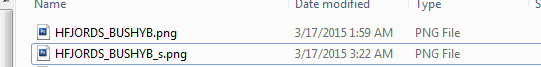
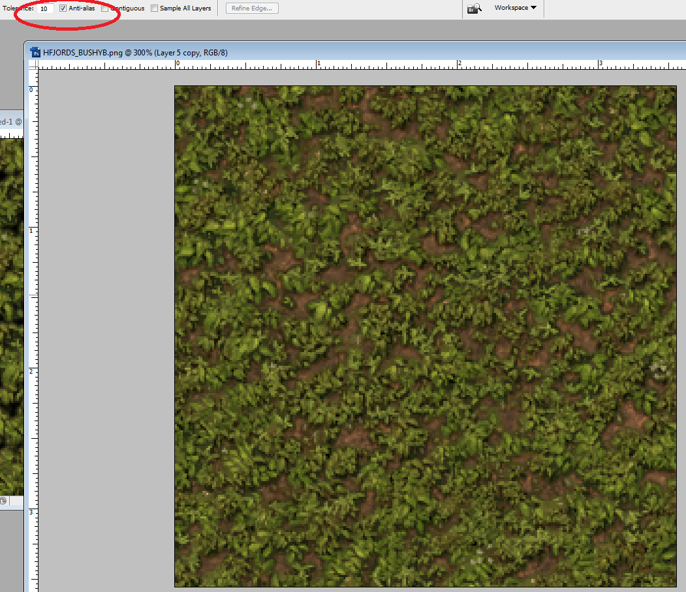
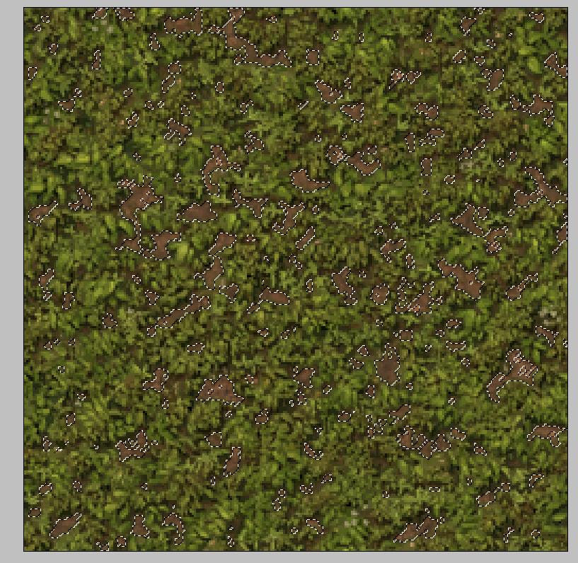
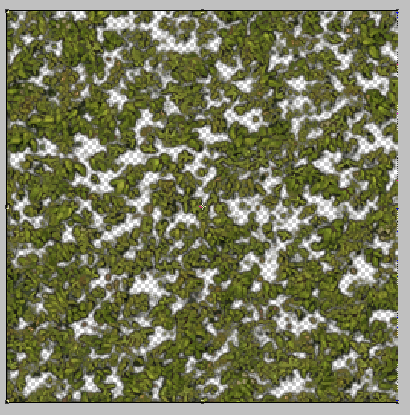
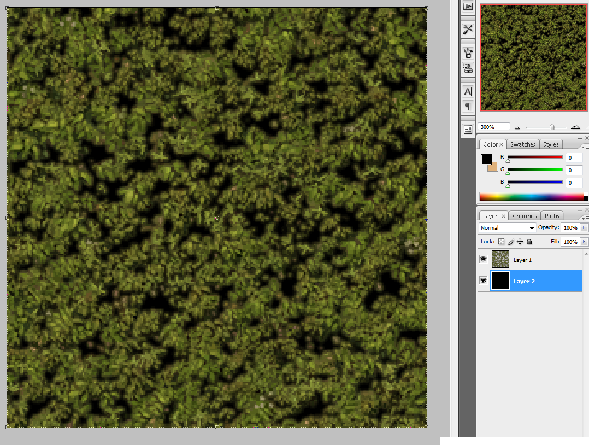
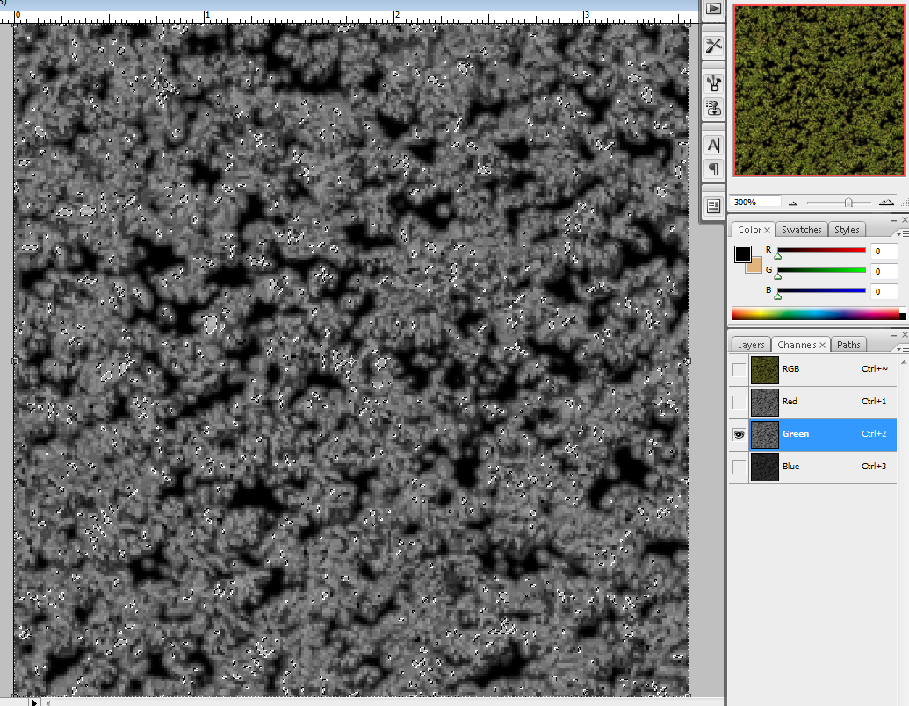
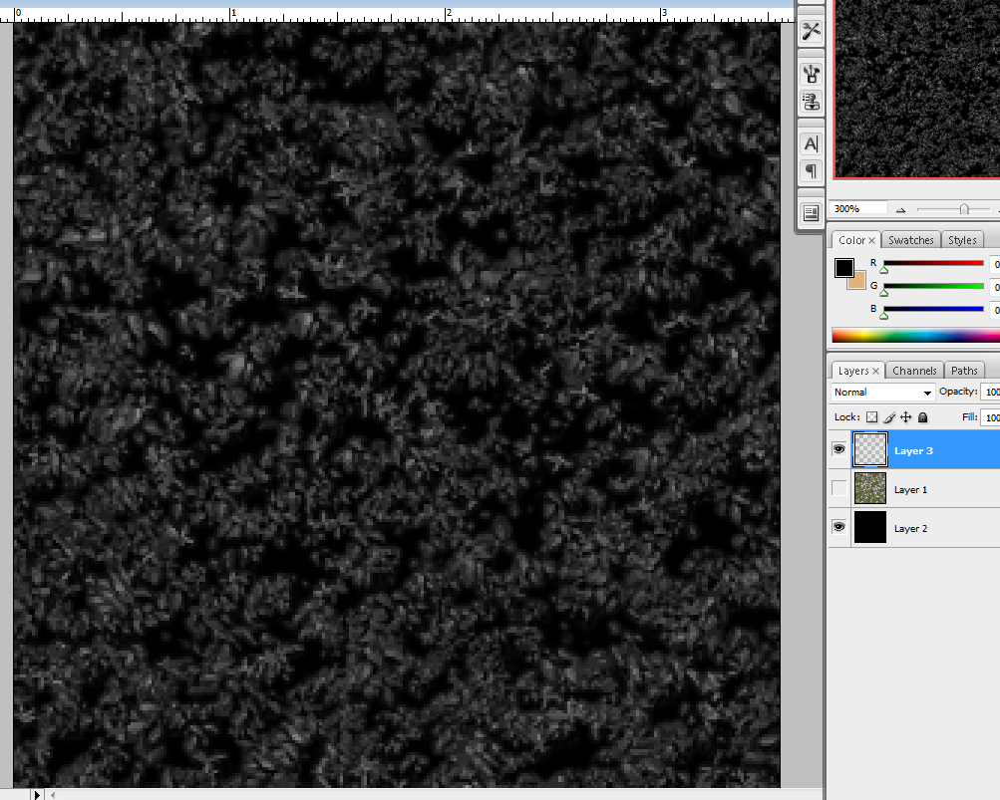
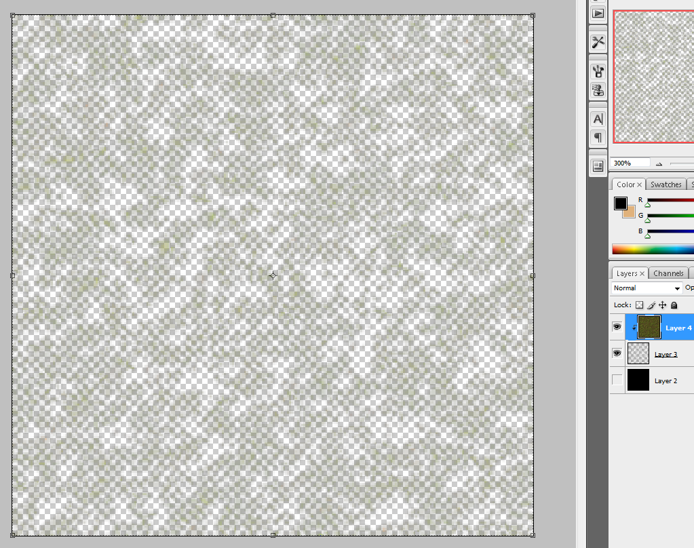
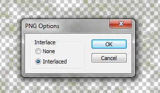

# Advanced Tileset Specular Mapping

## Step 1: Create your "_s" file

## Step 2: Separate the grass from the dirt
If your texture has only grass on it, or only one texture type on it, you can skip to Step 3.

Select your Magic Wand tool, set the Tolerance to around 10-20, make sure Anti-alias is checked.

Shift+Click some of the grass spots between until you get it all mostly selected.

Ctrl+C to copy, and Ctrl+V to paste onto a new layer. Afterwards, you can hide the old layer. You want it to look kind of bushy but not too clunky. Something like the image I have below. This could take some time to get it just right. I recommend feathering the edges a bit to make it a little smoother and less pixely.

## Step 3: Adjusting the levels

Create a new layer under your initial layer, and fill it with black. This is just to give you a background to see what you're working with for the next few steps.

Select your initial layer and move over to the Channels tab where it shows the RBG. Select the RBG color that best corresponds to your main color. In my case I selected green because I'm working with grass. Ctrl+Click the little preview image right next to the color name, and Ctrl+C to copy.

Go back to the Layers tab, create a new layer, and Ctrl+V to paste the selection onto that new layer. You can delete the other layer.

Go to Image > Adjustments > Levels, and adjust the Input Levels to somewhere between 0.35 and 0.25 until you get something like this.

Move the original texture layer that you hid in Step 2 on top of the new layer, and Ctrl+Alt+G to create a clipping mask. You can hide or delete the Black background layer at this point.

## Step 4: End Result

Select all layers, and Ctrl+E to merge them. Go to File > Save As, and save the file as a PNG.

Make sure that you save it as Interlaced for it to work as an alphamap.

Convert the files into blp, and put them in their respective folders. Now you should have some nice smooth highlights.

Daytime

Nighttime

## Credits
Vortalex