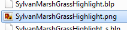
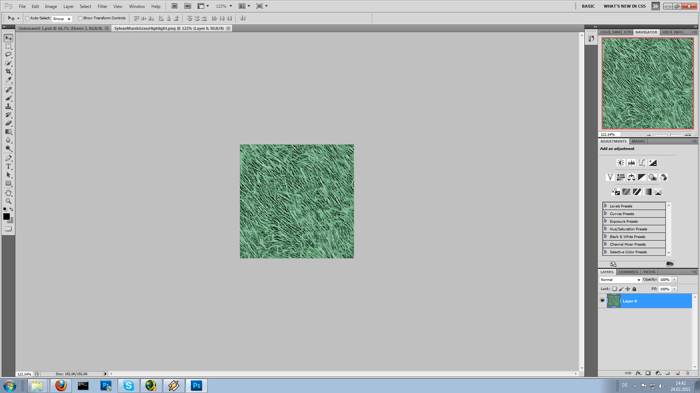
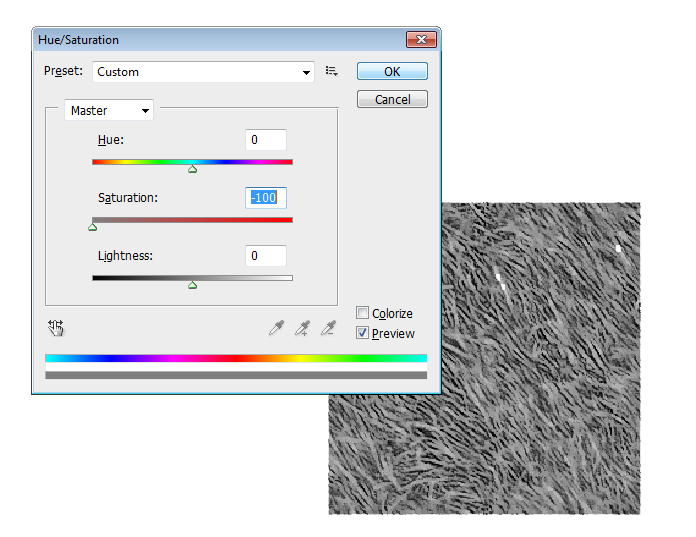
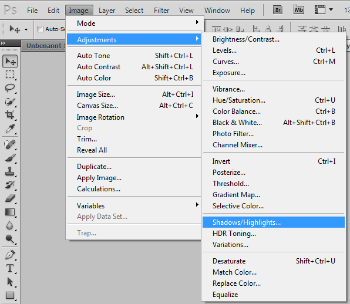
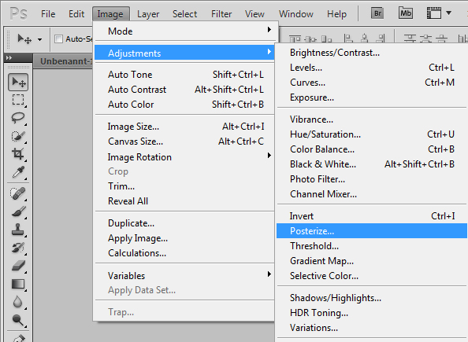
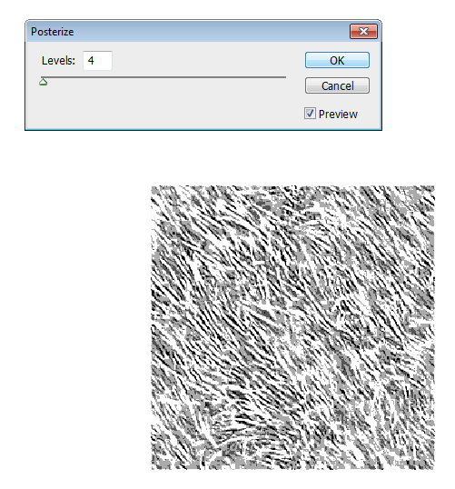
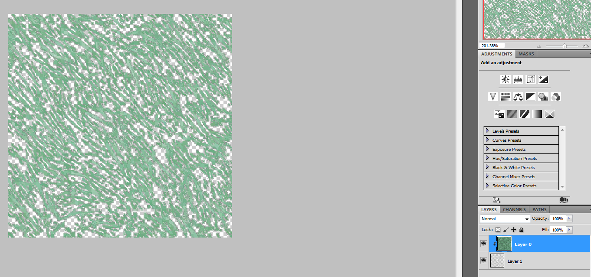
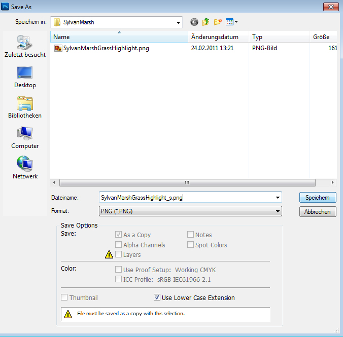
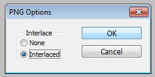

# Custom Tilesets

If you are about to build you own region, you'll quickly get to see that sometimes the tile sets ... just don't fit somehow.

It may be the color or something. like that ...
What i am not! going to show you here is how to create such a tile set. For tile sets you can use textures you will find on deviant art or you can paint your own!
One thing that you really have to be aware of , is that the tile sets is seamless. That means you can place one image of a tile set next to another without seeing any interruption in the image.

Now as you got your texture, save it as png file without! interlace. Ground textures can not have alpha maps.
Now just drag n' drop the .png file onto the Blpconverter ,and it should convert your png file to a .blp file.

Your blp file is now ready.

Now place your new tile set in your wow root file under wowroot\tileset\whatever\

The whatever can sure be replaced by any name you want. Normally it would be the best if you use the name of your new area(not the continent!) just like Blizz does it.

Or you can place it in wowroot\tileset\continentname\whatever\ 

Just make sure the file stays where it is.

Because if you use your new tileset and rename it later, you'll have to change the tileset path on every adt you worked with that tileset(and that can be some amount of work).

Now after you placed it there you can also build a MPQ or you directly insert it into a MPQ ,just with the same path. I always have the files i created laying extracted in my wow folder with the right path ,because when i want to make a new patch where everything is in it , i just copy the folders into a external folder and with that folder i build my MPQ without having to create all the paths manually in the MPQ program.

**Attention!**

Noggit ONLY reads tile sets from MPQs ,so make sure that if you want to use your new tile set it is implemented in a MPQ, in your DATA folder!

Now your new tile set should be ready for usage.

**BUT**

in game it will appear greenish. You may know that problem if you enter the Emerald dream for example.

**Why?**

Tile sets always have a extra specular tile set, which includes the highlights you may know in game as the sunshine reflection from the floor.
So what we got for every tile set is:
Elwynngrass.blp
Elwynngrass_s.blp

And the file with the _s is the specluar file, as you will see if you extract and convert one of them , they just include the highlights of the texture.

We are now going to recreate that progress and we are going to create a highlight image of a recolored blizzard tile set, which i am using for one of my areas.(use right click ->view image for details, especially in the photoshop part)

So take your blp file again and reconvert it via drag n' drop onto the Blpconverter.

now the png file should be again there.

Open up that png file with photoshop.

Now press ctrl+j to duplicate the texture layer.
on the new layer press ctrl+u to adjust some settings.

We are just going to turn the saturation to the low minimum to make it black n 'white.

Now use image->adjustments->shadow/highlights and just press ok when the new popup appears.

Now we are going to use the posterior tool.

And set to about 4 layers, depending on the texture. Make sure that not too much is white and play around until you are satisfied. The white you are seeing in the preview are the highlights so be careful to not to have too much!

Now switch to the magic-wand. Yeha!

Select a white pixel with it ,so that all the white of the modified image is selected.

Look at the tool settings! 0 Anti-Alias 

Now as the white parts are selected, press ctrl+x to cut them out.

Now press ctrl+v to have a new layer with just the white parts.

You can now delete the layer where you cut out the white parts.

Now all you have left is the layer with the heighlights and the old unmodified one.
Move the unmodified layer above the highlight layer and press ctrl+alt+g to create a clipping mask.

Now you have the heighlights wonderfull extracted.

Go to File-> save as... and save it as png file.

One thing: just name it like the old one but with _s in it ,so that you don't overwrite the old png file and already have the proper name for the specular file.

Remember to save it of course as interlaced, else you wouldn't have it as an alphamap.

Now just convert it back and place it in the same folder as the normal tileset file.
Now everything should work like a charm in game.

## Credits
Eluo

