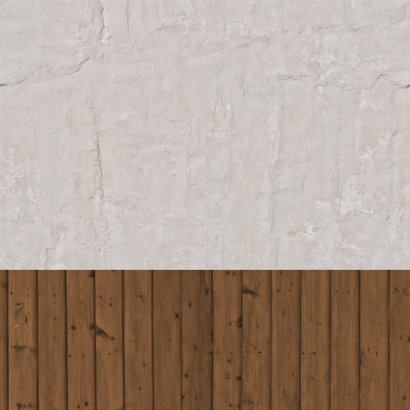
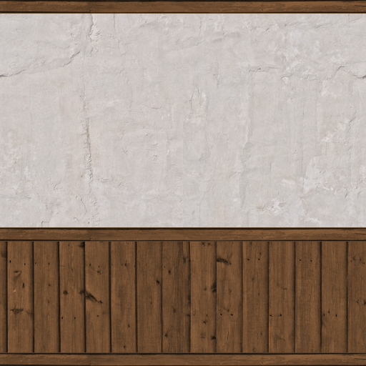
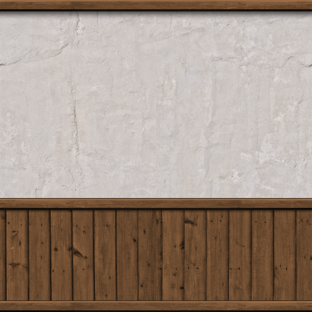
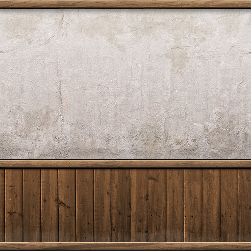

# Enhanced Architectural Textures

## The Problem

I bet this is something everybody has already experienced: you come across some graphical stuff and you immediately think "some noob did this, it looks totally unreal", but you could never describe what it really is that gives you the expression, or at least it takes a lot of experience to be able to tell.

So here's to all of those creating architectural textures with the just described effect (the good message is: if you realize it's looking bad, that's the first step to improving it!). I'll be giving you a sort of checklist together with an example on which you'll be able to see the effect.

I'm starting off with a pretty basic texture, quite "noobish" in appearance. It's already seamlessly tile-able and color corrected, but it looks pretty dull and unreal, although it's a realistic wall texture combined with wooden texture.

## Add Detail

### Different Structures

Now I've done the first step on this thing already: instead of having a simple white wall I added a wooden structure. Now even if you wanted a simple stone wall for let's say a temple, you could still add different stone structures, like seen here, with the different shades of gray resembling different stone structures, and the A and B standing for some kind of graphical element or hieroglyphic text.

Of course the whole texture should still make sense in an overall architectural context.

Concerning the example I'll add some more structures to it, three bars to be exact. One on the top of the image, one on the bottom and one on top of the seam between the wall texture and the wood. Those bars are going to be made of wood too.

Looking a lot better already, right?

### Plants/Organic Structures

Often plants like ivy, moss or tendrils can be found on old walls, roofs, floors...this adds a little "old" and "overgrown" feeling to your texture, but also a kind of realism - the thing we're heading for. Now although it won't make much sense adding it to my interior wall, I'm pretty sure you can recall having seen moss on roofs, some ivy vines on exterior walls etc.

Don't forget it when doing exterior stuff, but rather do it as a modification of your basic tile.

## Light and Shadow

Instead of having thousands of different maps for one texture like you're able to have in movie models, in game modeling the light and shadow information has to be rendered into the diffuse map (the diffuse map is practically equivalent to "texture" in the WoW engine, as it's being the the only texture map).

### Bevel

Beveling your layers is the first step on adding depth information to your 2d graphic. It enables you to create somewhat realistic shadows on structures sticking out.

In my case it's the wooden stuff I'm going to add some bevels to.

It's not a groundbreaking effect, but it's definitely something your eye will either recognize or miss in game.

### Shadows

Using the Outer Glow and Drop Shadow (or even Emboss Bevels) you're able to create some nice shadow effects with just a few clicks, just keep in mind where the light source is coming from! (most of the time it's going to be the sun, so the angles are most of the time 90° in PS)

On my interior wall the shadows will be thrown from the bars onto the wall and wood, although the one on timber won't be as "big" as the one on the white wall, because it doesn't have such a big difference in height to the bars.

Here's the result:

### 3.3. Gradient Overlays

The last thing when talking about shadows are the gradient overlays. Although they too are subtle, they'll make a huge difference in realism.

When doing gradients keep in mind what color your light source is and where it's coming from.

I often do gradients on both the several structures separately as well as one overall, just try to not too much brighten/darken your image, play with the opacity settings.

## 4. Dirt

### Dirten up the Pattern

Using simple Dirt Textures you'll be able to bring some diversity into your structures. The Dirt Textures should be of the same "family" though. Adding a rust texture to wood often doesn't look too good, but experiment!

### Cracks, Dots and Stains

Now here's where your custom brushes come in handy. I bet you all know where to get cracks and stains brushes.
Simply brush in some custom dirt on parts where it makes sense (realistic-wise).

The outcome can be pretty awesome, but I wanted to keep it pretty simple here:

### Used Edges etc.

This one's a bit tricky. You have to think of the parts of the texture that get used a lot and therefor will wear off eventually. This is pretty easily explained with edges: people will shrub along and the texture and color will change, that's what we're adding in by hand. You can either use brushes or simple strokes, depending on your texture.

Very simple white 2px strokes, but it definitely adds something to the texture.

### Accumulated Dirt - Water stains and dusty parts

Ask yourself where dust or water would leave "dirt" over the years and in which way. In my case the wood near the floor will be rubbed off a little so it gets brighter.

## Final Touches and Sharpen

This is my favorite part. I hope you kept all your stuff in nice layers because this is the time to fiddle around with your settings, try something out.

Once you're done, hit CTRL+SHIFT+E to merge all layers to the background and sharpen your image - you're done!

## Credits
Jack