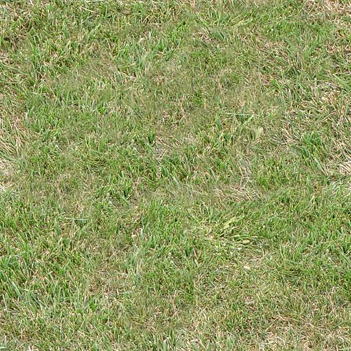
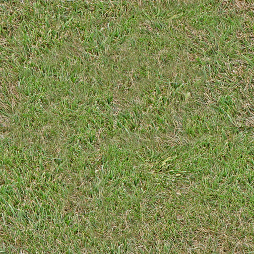

# Seamless Tile-able Texture
The first problem you'll stumble upon when creating textures is the lack of a texture blank library or collection. With a little effort and possibly cutting out some textures can be found in the internet, but you can be glad if they're shot from a 90° angle and with the right perspective. Most textures won't have the same hue or saturation over the whole picture and most of them won't be tile-able.

In the following tutorial I'll teach you how to fix all three points, given the right resource.

Here's the picture I'm starting with:

The perspective seems to be correct everywhere in the picture and no depth of field or any other blur occurring. However there are four things we need to change in order to be able to use it as a tile-able grass texture (or blank):

- Incorrect proportions (and size)
- Hue not equally distributed
- Saturation also not equally distributed
- Not seamless

Maybe you'll ask yourself why just scaling it down and making it seamless will do the work. Well, looking at the picture right now you won't notice anything weird. That's because your eye is automatically calculating light sources etc and even the fact that all blades of grass look different. So even though one is green, one is brown and another one is a darker green, inside a whole lot of them they all appear the same color.

Once the whole picture is tiled several times next to each other and then zoomed out a little (as it would be inside a game) your eye will be making out patterns of brown grass inside the green grass and will then automatically notice the same pattern on the other patches as well, making the grass texture seam unrealistic.

In order to prevent this, structure, hue and color should be somewhat equally distributed all over the texture.

Fixing the proportions is a pretty easy thing, but I still have some tipps for you.
First of all copy the whole picture you have, create a new 512x512 or whatever picture and paste the image into it. Using the transformation tool (shortcut: "ctrl+t") you can scale it down so it fits the whole image. Try keeping the proportions (percent of stretching) equal or near equal and don't scale it down too much. Always keep the relation to the player character in mind. Blades of grass as big as half the leg seem very unrealistic, at least as ground texture (not as model though). Too small will be bad either.

After this, your image is probably a bit too soft and blurred. You could either transform it down bit by bit (no more than 10% reduction per step), which means ctrl+t, both values 90%, accept transformation, ctrl+t, 90%, accept etc. or you could use sharpen mask and play with the values a little. I can recommend using both techniques simultaneously.

Now press "ctrl+a" to select everything on the canvas, "ctrl+c" to copy that part and "ctrl+v" to paste it onto a new layer. Delete the lower layer (where you cut it out) afterwards.

This way all the stuff not on your canvas (which is still there) will be deleted. We're going to move the image around later on so anything outside of the canvas would cause big trouble there.

Remember what I said about the patterns? Tiling the above texture illustrates that pretty well:

[Note: Any operations done to the structure of your texture, like editing small flowers into the grass, adding patches of snow via clouds etc. should be done BEFORE the next step or they will cause new seams. Remember this guys, or your work will be useless afterwards!]

Now go to "Filter -> Other -> Offset" and enter a value equal to half the lenght and width of your image into the corresponding field.

After hitting okay you'll be able to have a look at the way the texture would tile ingame:

It looks horrible, but we can change that with the clone tool. All you have to do is copy parts of the image and paint them over the seams. Here are some tips on that:

- Be careful not to hit the borders of the image, as you will most likely create new seams by doing so
- Don't just paint over the cross only, it'll be visible for the eye as it will look patched. Try moving inward from the cross as well.
- Use a brush that's not too small and not too big. As for 512x512 textures a soft edge 35 px brush seems pretty good for the job.
- Try eradicating different structures using this step. Don't copy both brown and green grass but either only green or only brown (not from the same part of the image all the time of course!!)

Now duplicate the layer with the texture on it and apply the High Pass filter ("Filter -> Other -> High Pass"). You have to play around with the settings a bit in order to find the perfect value where the structure of the texture is still visible but the brigthness and saturation is equally distributed all over the image.

[Note: You can apply the High Pass filter a second time and even though you could not choose any lower value before without destroying the structure, applying the HP filter a second time with the same value helps you to go a little further still without doing any harm to the structure]

Set the blending mode of this mostly grey upper layer (where you applied the HP filter) to "luminance" and you'll see that hue, saturation and brightness are now far better distributed all over the picture:

In this example the grass is a little too dark for it's purpose, I rather wanted a little brighter one like the one I started with. No worries there as we've still got adjustment layers!

[Note: Adjustment Layers >>>>>>>>>>>>>>> simple adjustment! Don't use the latter one, ALWAYS use the layers! Go to "Layer -> New Adjustment Layer -> xxx"]

As long as you're using either seamless or monocolor layer masks all adjustments won't do any harm to your texture. If you use clouds though or anything else, it will most likely create new seams when tiling it, keep that in mind.

The layers I have now that the texture's finished:

And here's the finished texture itself, compared to the "original" (down- and resized original)

BEFORE:

AFTER:

Tiled:

One more tipp I can give you is once finished, apply a sharpen filter ("Filters -> Sharpen -> Sharpen") and although it will look strange at first, the results ingame are pretty good.

(This has to do with the way our eye reacts: you tend to perceive hard edges better than soft edges this applies to moving as well as to standing still, so while standing still those edges will look weird, but while moving they look perfectly normal while without the sharpen it'd look like one green blob. And to be honest, whos going to stand there and stare at plain grass for a long time inside an MMORPG?).

## Credits
Jack